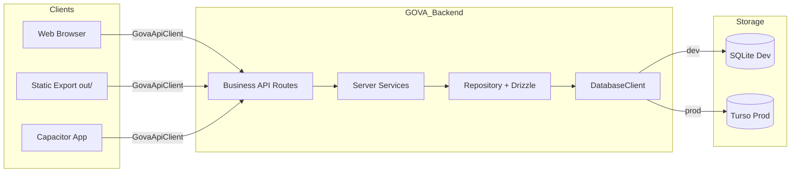
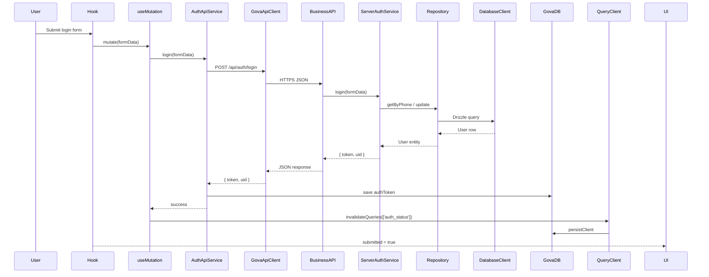

# GOVA Data Layer Architecture Guide

This document is the authoritative reference for how data flows through the GOVA project — from UI components to the database and back. It reflects the current **Client/Server** architecture: clients never talk to SQLite or Turso directly; they talk to the **GOVA API** through `GovaApiClient`.

**Core technologies:**

| Technology | Role |
|---|---|
| **GovaApiClient** | Single HTTP gateway for all client-side data access |
| **Next.js Business API Routes** | Server entry points (`/api/auth/*`, future `/api/products/*`, etc.) |
| **Drizzle ORM** | Type-safe schema definition and query building |
| **drizzle-zod** | Auto-generated Zod validation schemas from Drizzle tables |
| **TanStack Query** | Server-state caching, deduplication, and mutation lifecycle |
| **GovaDB (IndexedDB)** | Offline cache for auth tokens and React Query persistence |
| **SQLite** | Development database — **Single Source of Truth for schema design** |
| **Turso (libsql)** | Production database — schema synced from SQLite, no row migration |

---

## Table of Contents

1. [Architectural Principles](#architectural-principles)
2. [Client/Server Data Flow](#clientserver-data-flow)
3. [The Layered Architecture](#the-layered-architecture)
4. [GovaApiClient](#govaapiclient)
5. [Business API Routes](#business-api-routes)
6. [Database Client (Server-Only)](#database-client-server-only)
7. [SQLite — Schema Source of Truth](#sqlite--schema-source-of-truth)
8. [Schema Synchronization (Provisioning)](#schema-synchronization-provisioning)
9. [Database Schema & Migrations](#database-schema--migrations)
10. [Input Validation](#input-validation)
11. [TanStack Query & Offline Cache](#tanstack-query--offline-cache)
12. [Deployment Targets](#deployment-targets)
13. [Environment Variables](#environment-variables)
14. [Security Rules](#security-rules)
15. [Extension Guide: Adding a New Feature](#extension-guide-adding-a-new-feature)
16. [Testability](#testability)
17. [Configuration Layer](#configuration-layer)
18. [GovaDB (IndexedDB)](#govadb-indexeddb)
19. [GoVa Operation Monitor (`/dev/monitor`)](#gova-operation-monitor-devmonitor)
20. [Architecture Contract (Enforced)](#architecture-contract-enforced)
21. [Scripts & Commands Cheat Sheet](#scripts--commands-cheat-sheet)

---

## Architectural Principles

1. **Clients are platform-agnostic.** Web, static export, and Capacitor all use the same `GovaApiClient`. They do not know where the backend is hosted.
2. **No SQL from the client.** Raw SQL execution from the browser is forbidden. Only Business APIs accept structured JSON payloads.
3. **Repository builds queries.** Drizzle query construction lives exclusively in the Repository layer on the server.
4. **Database Client selects the driver.** Development → SQLite. Production server → Turso. No other layer knows the driver.
5. **SQLite defines schema.** All schema design happens on local SQLite files. Turso receives incremental DDL sync only — never row data.
6. **IndexedDB is a cache, not a database.** GovaDB stores auth tokens and TanStack Query cache for offline-first UX. It is not the primary data store.

---

## Client/Server Data Flow

### Development (`npm run dev`)

```
Browser
  ↓  GovaApiClient (same origin)
Next.js Business API  (/api/auth/*)
  ↓
Server Service  (auth-service.server.ts)
  ↓
Query / Command  (CQRS)
  ↓
Repository  (Drizzle)
  ↓
DatabaseClient  →  SQLite  (public/sync_data/sync_sqlite/)
```

### Production Server (hosted backend)

```
Browser / Capacitor / Static SPA
  ↓  GovaApiClient (HTTPS → GOVA_API_BASE_URL)
Business API  (/api/auth/*)
  ↓
Server Service → Query/Command → Repository → DatabaseClient → Turso
```

### Static Export (`npm run build:static`)

The `out/` folder is a pure SPA with **no Next.js server**. All data operations go through:

```
Static SPA  →  GovaApiClient  →  HTTPS  →  Remote GOVA Backend  →  Turso
```

Set `NEXT_PUBLIC_GOVA_API_BASE_URL` at build time to point to your hosted backend.



---

## The Layered Architecture

The server follows **Clean Architecture** with six domain layers (UI through Database Client on the server stack). The **full client-to-database path** adds `GovaApiClient` and **Business API** routes — see [Architecture Contract](#architecture-contract-enforced) for the complete enforced stack.

On the **client**, the Service layer is an HTTP adapter that preserves the same interface (`IAuthService`) so Hooks remain unchanged.

```
[ UI ] → [ Hook ] → [ Client Service ] → [ GovaApiClient ] → [ Business API ]
                                                              ↓
              Server: [ Server Service ] → [ Query/Command ] → [ Repository ] → [ Database Client ]
```

Client entry: `auth-service.ts` → `auth-api-service.ts` → `govaApi`  
Server entry: API routes → `auth-service.bootstrap.server.ts` → `auth-service.server.ts`

### 1. UI Component Layer

* **Location:** `src/components/`
* **Responsibility:** Render markup. Read loading/error/success state from hooks. Zero business logic, zero HTTP calls, zero SQL.
* **Example:** `LoginPageContent.tsx` consumes `useLogin()` and renders the form.

### 2. Custom Hook Layer

* **Location:** `src/features/[feature]/hooks/`
* **Responsibility:** Form state (React Hook Form + Zod), `useQuery` for reads, `useMutation` for writes, cache invalidation after mutations.
* **Example:** `use-login.ts` calls `authService.login()` — which resolves to `AuthApiService` on the client.

```typescript
export const AUTH_STATUS_QUERY_KEY = ['auth_status'] as const;

export function useAuthQuery() {
  return useQuery({
    queryKey: AUTH_STATUS_QUERY_KEY,
    queryFn: () => authService.isAuthenticated(),
  });
}
```

### 3. Service Layer

Two implementations, one interface:

| File | Environment | Behavior |
|---|---|---|
| `auth-api-service.ts` | Client (browser) | Calls `govaApi.post(GOVA_API_ROUTES.auth.login, …)` |
| `auth-service.server.ts` | Server | Business logic via injected Query/Command instances |
| `auth-service.bootstrap.server.ts` | Server | Wires commands/queries and exports `authService` singleton |

* **Client entry:** `auth-service.ts` re-exports `authApiService as authService`
* **Server entry:** API routes import `authService` from `auth-service.bootstrap.server.ts`
* **Wiring:** `operations/instances.ts` creates Command/Query objects with `userRepository`
* **Interface:** `auth-service.interface.ts` (`IAuthService`)

Client login saves the returned token to GovaDB IndexedDB. Server login validates credentials and returns `{ token, uid }` without touching IndexedDB.

### 4. Query / Command Layer (CQRS)

* **Location:** `src/features/[feature]/operations/`
* **Responsibility:** Separate read (Queries) and write (Commands) classes. Each delegates to the Repository.
* **Server-only.** Never imported by client code.

```typescript
// create-user.command.ts
async execute(user: Omit<User, 'id'>): Promise<void> {
  const existingUser = await this.userRepository.getByPhone(user.phone);
  if (existingUser) throw new Error('phoneAlreadyRegistered');
  await this.userRepository.create(user);
}
```

### 5. Repository Layer

* **Location:** `src/features/[feature]/repositories/`
* **Responsibility:** Entity-level data access via Drizzle ORM. No raw SQL strings. Driver-agnostic through `IDatabaseClient`.
* **Server-only** (`import 'server-only'`).

```typescript
async getByPhone(phone: string): Promise<User | null> {
  const rows = await this.database.db
    .select()
    .from(users)
    .where(and(eq(users.phone, phone), isNull(users.deletedAt)))
    .limit(1);
  // ...
}
```

### 6. Database Client Layer

* **Location:** `src/core/database/`
* **Responsibility:** Select SQLite or Turso driver. Expose Drizzle `db` instance and tracked `execute()`.
* **Server-only.** Throws if instantiated in the browser.

| Server Environment | Driver | Target |
|---|---|---|
| Development | `drizzle-orm/better-sqlite3` | `public/sync_data/sync_sqlite/allusers.db` |
| Production | `drizzle-orm/libsql` | Turso Cloud DB |

---

## GovaApiClient

The client-side HTTP gateway. All platforms use this — never `fetch` directly in features.

**Location:** `src/core/api/`

| File | Purpose |
|---|---|
| `gova-api-client.ts` | `GovaApiClient` class + `govaApi` singleton (emits dev monitor events) |
| `gova-http-transport.ts` | The only module allowed to call `fetch()` |
| `gova-api-config.ts` | Resolves `GOVA_API_BASE_URL` (platform-agnostic) |
| `gova-api-routes.ts` | Canonical route constants (`GOVA_API_ROUTES`) |
| `api-error.ts` | `ApiError` with HTTP status |
| `index.ts` | Public exports |

### Usage

```typescript
import { govaApi, GOVA_API_ROUTES } from '@/core/api';

const result = await govaApi.post<{ token: string; uid: string }>(
  GOVA_API_ROUTES.auth.login,
  { phone, password }
);
```

### Base URL Resolution

Priority order:

1. `NEXT_PUBLIC_GOVA_API_BASE_URL` — explicit remote backend (static export, Capacitor)
2. `NEXT_PUBLIC_GOVA_API_URL` — legacy alias (backward compatible)
3. `GOVA_API_BASE_URL` — build-time non-public override (CI)
4. Same origin + `NEXT_PUBLIC_GOVA_BASE_PATH` — local dev and co-hosted deploys

**The client never references Vercel, AWS, or any hosting provider by name.**

To move the backend to a new host, change one environment variable:

```env
NEXT_PUBLIC_GOVA_API_BASE_URL=https://api.your-domain.com
```

---

## Business API Routes

**Location:** `src/app/api/`

Low-level SQL proxy routes (e.g. `/api/db`) are **removed**. All routes are Business APIs:

| Route | Method | Purpose |
|---|---|---|
| `/api/auth/login` | POST | Authenticate user, return token |
| `/api/auth/register` | POST | Create new user account |
| `/api/auth/logout` | POST | Delegates to `authService.logout()` (session token cleared client-side) |

Each route:

1. Imports `authService` from `auth-service.bootstrap.server.ts`
2. Delegates to the server `AuthService`
3. Returns JSON via `apiSuccess()` / `mapServiceError()`

**Dev migrations:** Applied automatically on first SQLite connection in `sqlite-db-client.ts` (not in route handlers).

**Adding future routes:** `/api/products/*`, `/api/orders/*`, etc. — follow the same pattern.

### CORS

`src/middleware.ts` adds CORS headers to all `/api/*` routes so static export and Capacitor clients can call a remote backend.

Configure allowed origins:

```env
GOVA_CORS_ORIGINS=https://your-static-site.com,capacitor://localhost
```

Default dev origins (localhost, Capacitor shells) are included when `GOVA_CORS_ORIGINS` is not set.

---

## Database Client (Server-Only)

**Files:**

| File | Role |
|---|---|
| `db-client.ts` | Top-level driver selector (singleton `dbClient`) |
| `sqlite-db-client.ts` | Development: `better-sqlite3` + Drizzle |
| `turso-db-client.ts` | Production: `@libsql/client` + Drizzle |
| `abstract-database-client.ts` | Shared CRUD helpers + dev monitor instrumentation |
| `ensure-migrations.ts` | Applies Drizzle migrations on first SQLite connection in dev |
| `environment.ts` | Client-safe runtime detection helpers |
| `environment.server.ts` | Server-only SQLite path helpers |

Dev detection (server):

```typescript
GOVA_MODE === 'development'
|| NEXT_PUBLIC_GOVA_MODE === 'development'
|| NODE_ENV === 'development'
```

Turso access is **blocked during development runtime** unless `GOVA_PROVISIONING=true` (build/deploy scripts only).

---

## SQLite — Schema Source of Truth

All schema design happens on SQLite files in:

```text
public/sync_data/sync_sqlite/
```

During development, **every** database operation (SELECT, INSERT, UPDATE, DELETE, transactions, migrations) runs exclusively against these files. Turso is never contacted at development runtime.

Schema changes workflow:

1. Edit `src/core/database/schema.ts`
2. Run `npx drizzle-kit generate`
3. Migrations apply automatically on first Business API request in dev
4. Schema sync pushes DDL to Turso at build/deploy time (see below)

---

## Schema Synchronization (Provisioning)

**Location:** `src/core/provisioning/`

A standalone layer used **only during build, deployment, and CI** — never at application runtime.

| Module | Role |
|---|---|
| `sqlite-schema-reader.ts` | Read full schema from SQLite files |
| `turso-schema-reader.ts` | Read full schema from Turso |
| `schema-diff.ts` | Compute minimal DDL to make Turso match SQLite |
| `schema-sync.ts` | Execute incremental sync, write report JSON |
| `schema-version.ts` | SHA-256 fingerprint of schema structure |
| `turso-platform-api.ts` | Turso Platform API (only place using `TURSO_API_TOKEN`) |
| `turso-provisioner.ts` | Create Turso DB + auth tokens |

### What Schema Sync Does

```
SQLite schema  →  Schema Diff  →  Turso
                 (incremental DDL only)
```

Supported operations: `CREATE TABLE`, `ALTER TABLE ADD COLUMN`, `CREATE INDEX`, `CREATE VIEW`, `CREATE TRIGGER`.

**Never executed:** INSERT, UPDATE, DELETE, or any row data transfer.

Example: if you add one column locally:

```sql
ALTER TABLE users ADD COLUMN avatar TEXT;
```

Only that statement runs on Turso — no `DROP + CREATE` of the entire table.

### Schema Sync Report

Written to: `public/sync_data/schema-sync-report.json`

Viewable in the Operation Monitor **Schema Sync** tab.

### Scripts

```bash
npm run db:schema:sync       # Sync SQLite schema → Turso (schema only)
npm run db:provision:turso   # Create Turso DB + tokens + schema sync
npm run db:create:sqlite     # Reset local SQLite from Drizzle migrations
```

Schema sync runs automatically as part of `npm run build`.

---

## Database Schema & Migrations

### Schema Definition

All tables are defined in `src/core/database/schema.ts`:

```typescript
export const users = sqliteTable('users', {
  id: integer('id').primaryKey({ autoIncrement: true }),
  uid: text('uid').notNull().unique(),
  phone: text('phone').notNull().unique(),
  email: text('email'),
  password: text('password').notNull(),
  lastLoginAt: text('last_login_at'),
  createdAt: text('created_at').$defaultFn(() => new Date().toISOString()),
  updatedAt: text('updated_at').$defaultFn(() => new Date().toISOString()),
  deletedAt: text('deleted_at'),
});
```

### Migration Pipeline

1. `drizzle.config.ts` points to `src/core/database/schema.ts`
2. Output: `src/core/database/migrations/`
3. Generate: `npx drizzle-kit generate`
4. Apply (dev): `ensureDevMigrations()` on first Business API request

---

## Input Validation

`drizzle-zod` generates Zod schemas from Drizzle table definitions:

```typescript
import { createInsertSchema } from 'drizzle-zod';
import { users } from '@/core/database/schema';

const baseSchema = createInsertSchema(users, {
  phone: createPhoneField(t),
  password: z.string().min(4, t('auth.validation.passwordMinLength')),
});

return baseSchema.pick({ phone: true, password: true, email: true }).extend({
  confirmPassword: z.string().min(1),
  phoneVerified: z.boolean().refine((val) => val === true),
}).refine((d) => d.password === d.confirmPassword, { path: ['confirmPassword'] });
```

Validation runs in the Hook layer (client) before any API call is made.

---

## TanStack Query & Offline Cache

### Overview

TanStack Query handles all **read state** in Hooks. Writes use `useMutation`. The full cache persists to GovaDB IndexedDB for instant reload without a network round-trip.

### Provider Defaults (`src/core/providers/query-provider.tsx`)

| Setting | Value | Effect |
|---|---|---|
| `staleTime` | 5 min | Serve cached data without refetching |
| `gcTime` | 24 h | Retain data in memory and IndexedDB |
| `networkMode` | `offlineFirst` | Serve cache first, refetch silently |
| `retry` | 1 | One retry on failure |
| `refetchOnWindowFocus` | `false` | No refetch on tab switch |

### GovaDB Persister

`src/core/database/gova-db-persister.ts` persists the React Query cache to `GOVA_DB_STORES.QUERY_CACHE` in IndexedDB.

Auth tokens are stored separately in `GOVA_DB_STORES.AUTH`.

### Mutation → Cache Invalidation Flow



### Offline Behavior

On page load, `PersistQueryClientProvider` restores the cache from IndexedDB before any network request. `isAuthenticated()` reads the auth token from IndexedDB locally — no API call required for auth status checks.

---

## Deployment Targets

| Target | Command | API | Database |
|---|---|---|---|
| Local development | `npm run dev` | Same origin `/api/*` | SQLite |
| Hosted backend | `npm run build` + deploy | Same origin or remote | Turso |
| Static export (GitHub Pages) | `npm run build:static` | Remote via `GOVA_API_BASE_URL` | None (SPA only) |
| Capacitor (Android / iOS) | `npm run cap:build` | Vercel backend (baked by `cap:build`) | None (native shell over `out/`) |

All four targets share **identical application code**. Only environment configuration changes.

---

## Environment Variables

```env
# ── GOVA API (client-side, safe to expose) ──
NEXT_PUBLIC_GOVA_API_BASE_URL=     # Remote backend URL (static/Capacitor). Empty = same origin.
NEXT_PUBLIC_GOVA_BASE_PATH=        # Asset base path (GitHub Pages sub-path)

# ── Turso runtime (server-only) ──
TURSO_DATABASE_URL=
TURSO_AUTH_TOKEN=

# ── Turso provisioning (build/deploy scripts only) ──
TURSO_API_TOKEN=
TURSO_ORGANIZATION=

# ── Server CORS ──
GOVA_CORS_ORIGINS=

# ── App mode ──
GOVA_MODE=development              # development | production | static

# ── Capacitor (platform layer only) ──
CAPACITOR_SERVER_URL=              # Optional live reload (e.g. http://192.168.1.10:3000). Unset for production.
GOVA_CAPACITOR_API_BASE_URL=       # Optional override for npm run cap:build (default: platform/capacitor.defaults.ts)
```

**Never expose:** `TURSO_API_TOKEN`, `TURSO_AUTH_TOKEN` in client bundles, IndexedDB, localStorage, or logs.

---

## Security Rules

| Rule | Status |
|---|---|
| No SQL from the client | Enforced — `/api/db` removed |
| No database tokens in the browser | Enforced — Turso credentials are server-only |
| No Platform API at runtime | Enforced — `TURSO_API_TOKEN` only in provisioning scripts |
| Business APIs only | Enforced — structured JSON in/out |
| CORS configured per deployment | Via `GOVA_CORS_ORIGINS` |
| Repository is server-only | Enforced via `import 'server-only'` |

---

## Extension Guide: Adding a New Feature

Example: adding a `Product` feature.

### Server side

1. **Entity** — `src/features/product/entities/product.entity.ts`
2. **Schema** — add table to `src/core/database/schema.ts`, run `npx drizzle-kit generate`
3. **Repository** — `src/features/product/repositories/` (server-only)
4. **Operations** — `commands/` and `queries/`
5. **Service** — `product-service.server.ts` (business logic)
6. **API Routes** — `src/app/api/products/route.ts`, etc.

### Client side

7. **Routes** — add paths to `GOVA_API_ROUTES` in `gova-api-routes.ts`
8. **API Service** — `product-api-service.ts` using `govaApi.get/post`
9. **Client export** — `product-service.ts` re-exports the API adapter
10. **Query keys** — stable constants in `src/features/product/hooks/`
11. **Hooks** — `useQuery` / `useMutation` with cache invalidation
12. **UI** — consume hooks only

No changes to `DatabaseClient` or `GovaApiClient` internals are required.

---

## Testability

| Layer | How to test |
|---|---|
| Repository | Inject mock `IDatabaseClient` with in-memory Drizzle |
| Server Service | Inject mock `IUserRepository` |
| API Routes | Integration tests against route handlers with test DB |
| Client Service | Mock `govaApi` methods |
| Custom Hook | Mock `IAuthService`, wrap with `QueryClientProvider` |
| UI Component | Render with pre-seeded `QueryClient` data |

---

## Configuration Layer

**Location:** `src/core/config/`

The **only** place allowed to read `process.env` (enforced by Architecture Contract).

| File | Purpose |
|---|---|
| `runtime-env.ts` | `isDevelopment`, `isDevRuntime()`, `isStaticExportBuild()`, `isProvisioningContext()` |
| `public-env.ts` | `NEXT_PUBLIC_*` values baked into the client bundle |
| `server-env.ts` | Server-only re-export with `import 'server-only'` |
| `server-env.values.ts` | Turso credentials, CORS origins — used by scripts and server code |

Client code imports `publicEnv` and `isDevelopment` from `@/core/config`. Server code imports secrets from `server-env.ts` or `server-env.values.ts` (build scripts).

---

## GovaDB (IndexedDB)

**Location:** `src/lib/gova-db/index.ts`

Browser-side offline cache — **not** the primary database. All CRUD operations are instrumented in development via `gova-db-monitor.ts`.

| Store | Key | Purpose |
|---|---|---|
| `auth` | `auth` | Auth token cache (`govaDbGetAuth` / `govaDbSetAuth`) |
| `guestSessions` | `current` | Guest session ID |
| `queryCache` | `rq_cache` | TanStack Query persistence (`gova-db-persister.ts`) |
| `sellerOnboarding` | dynamic | Zustand onboarding state |
| `appSettings` | dynamic | Reserved for future app settings |

Auth Client Service writes tokens here after successful login. `useAuthQuery` reads auth status from this store (not from the server).

---

## GoVa Operation Monitor (`/dev/monitor`)

Available only when `NODE_ENV === 'development'`. Access at `/dev/monitor`.

The monitor provides **end-to-end visibility during development** across the client path and server-side auth flows. It is wired at the infrastructure level — hooks pass `meta`, `GovaApiClient` emits HTTP traces, GovaDB emits IndexedDB traces, and Business API responses carry a dev trace header with server events.

### Monitoring coverage matrix (development)

| Data path | Monitored? | How | Layer in UI |
|---|---|---|---|
| TanStack Query (hooks) | Yes | `query-observer.ts` + hook `meta` | `hook`, `cache` |
| GovaApiClient → Business API | Yes | `gova-api-monitor.ts` | `gova-api` |
| Server trace (per HTTP response) | Yes | `X-Gova-Dev-Trace` header → `emit-server-trace.ts` | `service`, `query`, `database` |
| Drizzle SQL (dev) | Yes | `drizzle-dev-logger.ts` in trace header | `database` |
| GovaDB IndexedDB | Yes | `gova-db-monitor.ts` wraps all IDB ops | `cache` |
| Query persister (IDB) | Yes | Via instrumented `govaDbSet` / `govaDbGet` | `cache` |
| Static JSON via `getPublicJson` | Yes | HTTP layer (e.g. categories, schema report) | `cache` |
| Bundled JSON imports (`home-*.json`, i18n) | No | Build-time imports, no runtime hook | — |
| Theme / app prefs (`localStorage`) | No | Outside data plane | — |
| Provisioning scripts (`schema-sync` at CI) | No | Not browser runtime | — |
| Turso Platform API (`turso-platform-api.ts`) | No | Build/deploy scripts only | — |

### Dev trace header (`X-Gova-Dev-Trace`)

During development, every Business API response from `apiSuccess()` / `apiError()` may include a base64url-encoded JSON array of server events collected via `AsyncLocalStorage`:

```
Business API route  (runTracedBusinessRoute)
  → AuthService     (traceServerLayer)
  → Query/Command   (traceServerLayer)
  → Drizzle ORM     (drizzle-dev-logger → SQL in trace)
```

`GovaApiClient` reads this header after each Business API call and merges child events into the monitor store with `parentId` linking to the HTTP record. This bridges the Client/Server split without WebSockets.

**Key files:**

| File | Role |
|---|---|
| `server-trace.ts` | AsyncLocalStorage collector (server-only) |
| `trace-server-layer.ts` | Wraps server service / command / query spans |
| `drizzle-dev-logger.ts` | Logs Drizzle SQL into the trace |
| `dev-trace-types.ts` | Shared event shapes + header name |
| `emit-server-trace.ts` | Client-side parser + store emitter |
| `gova-api-monitor.ts` | HTTP timing + trace header ingestion |
| `gova-db-monitor.ts` | IndexedDB operation emitter |
| `auth-monitor-meta.ts` | Standard TanStack `meta` for auth hooks |

### What the monitor sees

| Source | What it records | Layer |
|---|---|---|
| TanStack Query observer | Query/mutation lifecycle, cache hits, queryFn timing, result diff | `hook`, `cache` |
| `GovaApiClient` | Business API HTTP (method, route, timing, status) | `gova-api` |
| `X-Gova-Dev-Trace` | Server service, commands/queries, Drizzle SQL | `service`, `query`, `database` |
| GovaDB (`gova-db-monitor`) | IndexedDB get/set/delete/clear per store | `cache` |
| Zustand monitor store | Aggregates traces, N+1/duplicate detection, call-graph edges | — |
| `SchemaSyncPanel` | Static schema-sync report (not live sync) | — |

Auth hooks pass monitor metadata and call `startNewFlow()` on submit:

```typescript
// use-login.ts
meta: authMonitorMeta('useLogin', 'LoginPageContent', 'Login', 'UPDATE'),
// onSubmit: startNewFlow() then mutation.mutate()
```

Shared helper: `src/features/auth/hooks/auth-monitor-meta.ts`.

### Request flow grouping

`startNewFlow()` is called when the user submits login/register forms. All operations in that action share a `requestFlowId`, visible in the **TIMELINE** and **OPERATIONS** tabs.

HTTP records link to server traces via `parentId`. Server SQL appears as child events under the matching `POST /api/auth/*` HTTP bar in the flame chart.

### Out of scope (by design)

These are **not** part of the runtime data plane and are intentionally not monitored:

- Bundled static imports (`import data from '@/data/...'`)
- `localStorage` theme and UI preferences
- CI/build-time provisioning (`npm run db:schema:sync` during deploy)
- Direct `govaHttpFetch` in `turso-platform-api.ts` (provisioning only)

### Legacy note

`AbstractDatabaseClient._trackedExecute()` still instruments raw SQL on the server, but auth uses Drizzle ORM directly. Server SQL visibility comes from **`drizzle-dev-logger`** in the dev trace header, not from `_trackedExecute`.

---

### Header Bar

> Controls the monitoring session and export tools.

| Control | What it does |
|---|---|
| **LIVE MONITORING badge** | Indicates the monitor is actively receiving new operation events |
| **Light / Dark Mode** | Switches the dashboard color theme |
| **Pause / Resume Stream** | Stops or restarts live event ingestion without clearing existing data |
| **Clear logs** | Wipes all recorded operations from the current session |
| **Export JSON** | Downloads the full operation log as a JSON file |
| **Export HTML** | Downloads a self-contained HTML snapshot of the current view |
| **Print PDF** | Opens the browser print dialog for a PDF export |

---

### Filters Panel

> Narrows the operation list across all tabs. Filters apply globally until reset.

| Filter | What it does |
|---|---|
| **Feature** | Show operations from a specific feature module (e.g. `auth`) |
| **Page** | Filter by the page route where the operation originated |
| **Component** | Filter by React component name |
| **Hook** | Filter by custom hook name (e.g. `useLogin`) |
| **Service** | Filter by service class name |
| **Repository** | Filter by repository class name |
| **Table** | Filter by database table accessed |
| **Entity** | Filter by domain entity name |
| **Query Key** | Filter by TanStack Query key (e.g. `auth_status`) |
| **Op Type** | Filter by SQL operation type: SELECT, INSERT, UPDATE, DELETE |
| **Status** | Filter by outcome: success, pending, error |
| **DB Driver** | Filter by SQLite-Dev or Turso-Production |
| **Cache Source** | Filter by Memory, IndexedDB, **HTTP (GovaApiClient)**, or Database origin |
| **Search bar** | Free-text search across features, SQL, hooks, query keys, and error messages |
| **Reset Filters** | Clears all active filters |

---

### Tab: DASHBOARD

> High-level health overview of all recorded operations in the current session.

Shows summary stat cards:

| Stat | What it means |
|---|---|
| **Total Operations** | Count of all recorded events after filters |
| **Reads (SELECT)** | Number of database read operations |
| **Writes (MUTATIONS)** | Number of TanStack Query mutations |
| **Total DB Calls** | Server-side SQL executions recorded |
| **Cache Hits / Misses / Hit Rate** | TanStack Query cache effectiveness |
| **Active Queries / Mutations** | Currently in-flight operations |
| **Offline / Online Reads** | Reads served from cache vs. network |
| **Avg DB Time** | Mean SQL execution time in milliseconds |
| **N+1 Query Alerts** | Flows where the same table is SELECTed repeatedly (threshold-based) |
| **Duplicate Queries** | Identical SQL+params executed within 2 seconds |

Also shows:

- **Slowest DB Operations** — top slow queries; click a row to open the detail drawer
- **N+1 / Duplicate Warnings** — flagged operations with DUPLICATE or N+1 ALERT badges

---

### Tab: OPERATIONS

> Live hierarchical trace tree grouped by request flow.

Shows every operation as a collapsible tree organized by `requestFlowId` (one user action = one flow). Each leaf node shows the operation type, status, and duration.

| Control | What it does |
|---|---|
| **Auto-scroll** | Automatically scrolls to the newest operation as events arrive |
| **Tree nodes** | Click a leaf to open the Operation Details drawer |
| **Layer color dots** | Blue = hook/cache layer, Red = database layer |

Use this tab to step through exactly which layers fired for a single user action.

---

### Tab: TIMELINE

> Visual flame chart and step-by-step replay for a single request flow.

| Section | What it does |
|---|---|
| **Flow selector** | Pick which user-initiated request flow to inspect |
| **Flame Chart (Layer Gantt Trace)** | Horizontal bars per layer (`ui` → `hook` → `service` → **`gova-api`** → `query` → `repository` → `database` → `cache`) |
| **Scrub Timeline Replay** | Slider to step through operations one-by-one in execution order |

Click any bar to jump to that operation's detail drawer. Useful for spotting slow layers and sequential bottlenecks.

---

### Tab: CALL-GRAPH

> SVG directed graph of the call chain across architecture layers.

Renders nodes in columns by layer (ui → hook → service → **gova-api** → query → repository → database/cache) with arrows showing call direction.

- Click a node to open its operation details
- Empty state means no operations match the current filters — run some requests first

Use this to understand how layers connect for complex flows.

---

### Tab: DEPENDENCY

> Architecture map of Service → Repository → Query/Command relationships.

Force-layout SVG showing which services call which repositories and queries, with operation counts per node.

Use this to verify Clean Architecture boundaries and detect unexpected cross-layer coupling.

---

### Tab: ANALYTICS

> Ranked usage statistics for the current session.

| Section | What it shows |
|---|---|
| **Most Active Features** | Features generating the most operations |
| **Most Active Pages** | Routes with the highest operation volume |
| **Most Active Tables** | Database tables accessed most frequently |
| **Most Active Repositories** | Repository classes with the most SQL calls |

Use this to identify hot paths and prioritize optimization.

---

### Tab: SCHEMA-SYNC

> Displays the latest SQLite → Turso schema synchronization report.

Shows:

| Field | What it means |
|---|---|
| **SQLite Version** | SHA fingerprint of the local SQLite schema |
| **Turso Before / After** | Turso schema fingerprint before and after sync |
| **Duration** | Time taken for the last sync run |
| **Tables Modified / Columns Added / Indexes Added** | Counts of incremental DDL operations applied |
| **Operations list** | Human-readable description of each DDL change |
| **SQL Executed** | Raw DDL statements sent to Turso |
| **Warnings / Errors** | Non-fatal skips or failures during sync |

Report source: `public/sync_data/schema-sync-report.json` (generated by `npm run db:schema:sync` or `npm run build`).

If the report is missing, run `npm run db:schema:sync` or deploy the GOVA backend first.

---

### Tab: PINNED

> Bookmarked operations for later investigation.

Hover over any operation in the Operations or Timeline tabs and pin it with the ⭐ button. Pinned operations appear here for easy reference across sessions (until logs are cleared).

---

### Operation Details Drawer

> Slide-in panel with full context for a single selected operation. Opens when you click any operation row, bar, or graph node.

| Section | What it shows |
|---|---|
| **Pin to Top** | Bookmark this operation in the Pinned tab |
| **Trace Information** | Correlation ID, Flow ID, feature, page, hook, service, repository, DB driver, status |
| **HTTP Request** | Method + route for GovaApiClient operations (e.g. `POST /api/auth/login`) |
| **Performance Metrics** | Execution duration (ms), memory delta, rows read/written |
| **Raw Executed SQL** | SQL + parameters (only if captured — typically not for Drizzle repository calls) |
| **Query Result Diff** | Line-by-line JSON diff when a TanStack Query refetch changed cached data |
| **Error Message / Stack Trace** | Full error details when status is `error` |

---

## Architecture Contract (Enforced)

The architecture described in this guide is not documentation-only. It is enforced by an **Architecture Contract** — automated rules that run on every build and in CI. Any violation fails `npm run architecture:check`, `npm run build`, and Pull Request checks. There are **no ignore rules, no eslint-disable exceptions, and no per-file waivers**. To change the rules, edit the contract itself (`src/core/architecture/contract.ts`) — that is an explicit architectural decision.

### Official Layer Stack

```
UI
  ↓
Hooks
  ↓
Client Services
  ↓
GovaApiClient
  ↓
Business API
  ↓
Server Services
  ↓
Query / Command
  ↓
Repository
  ↓
Database Client
  ↓
SQLite / Turso
```

No shortcut paths are allowed. Every new feature (Products, Orders, Categories, Invoices, etc.) must follow the same layers.

### Import Rules (Summary)

| Layer | May import | Must never import |
|---|---|---|
| **UI** | Hooks, Components, UI utilities | Repository, DatabaseClient, Drizzle, Server Services, Queries, Commands |
| **Hooks** | Client Services | Repository, Database, Drizzle |
| **Client Services** | GovaApiClient | `fetch`, axios, SQL, Repository |
| **GovaApiClient** | HTTP transport (`gova-http-transport.ts`) | Direct DB access |
| **Business API** | Server Services | Repository, Operations, DatabaseClient, Client Services |
| **Server Services** | Query / Command | Repository (direct), Drizzle, DatabaseClient |
| **Query / Command** | Repository | DatabaseClient, Drizzle |
| **Repository** | DatabaseClient, Drizzle | UI, Hooks, Client code |
| **Database Client** | SQLite, Turso, libsql drivers | Everything above |
| **Configuration** | — | Only place for `process.env` |

**Wiring pattern:** Command/Query instances that need a repository are created in `operations/instances.ts` (Operations layer). Server Services receive pre-wired commands via `auth-service.bootstrap.server.ts`. Business API routes import only from Server Services bootstrap modules.

### Hard Bans (Build-Time)

| Rule | Allowed only in |
|---|---|
| `fetch()`, axios, XMLHttpRequest, WebSocket, SSE | `src/core/api/gova-http-transport.ts` |
| Raw SQL (`SELECT … FROM`, `INSERT INTO`, etc.) | Repository, Database Client, Provisioning (schema sync) |
| `drizzle-orm` imports | Repository, `src/core/database/**` |
| `@libsql/client`, `better-sqlite3` | Database Client, Provisioning |
| `process.env` | `src/core/config/runtime-env.ts`, `public-env.ts`, `server-env.ts`, `server-env.values.ts` |
| Secrets (`TURSO_API_TOKEN`, `VERCEL_TOKEN`, etc.) | Server-only / Configuration — never in client-accessible files |
| `server-only` modules in Client Components | Forbidden |
| React Components / Hooks / Client Services in Server code | Forbidden |

### Running the Check

```bash
npm run architecture:check
```

Example success output:

```
Architecture Report

✔ UI Layer
✔ Hooks Layer
✔ Client Services
✔ GovaApiClient
✔ Business APIs
✔ Server Services
✔ Query Layer
✔ Command Layer
✔ Repository Layer
✔ Database Client
✔ SQLite Rules
✔ Turso Rules
✔ No SQL Outside Repository
✔ No fetch Outside GovaApiClient
✔ No Secrets In Client
✔ No Drizzle Outside Repository
✔ No Invalid Imports
✔ Configuration Layer

Architecture Score

100%
```

Example failure:

```
Architecture Violation

Layer:
business-api

File:
src/app/api/auth/login/route.ts

Violation:
Database Client cannot be imported from Business API.

Allowed:
Business API → Server Services only.

Build Failed.
```

### CI Integration

| Workflow | When | Checks |
|---|---|---|
| `.github/workflows/ci.yml` | Every PR and push to `main` | `architecture:check`, `typecheck`, `lint` |
| `.github/workflows/nextjs.yml` | Pages deploy | `architecture:check` before `build:static` |
| `npm run build` / `build:static` | Local and production builds | `architecture:check` runs before Next.js build |

A failing architecture check blocks merge.

### Contract Source Files

| File | Role |
|---|---|
| `src/core/architecture/contract.ts` | Layer definitions, import matrix, allowed paths |
| `scripts/architecture-check.ts` | Full-project scanner and reporter |

### Adding a New Feature Under the Contract

1. Create the full layer set under `src/features/<name>/`:
   - `hooks/`, `services/*-api-service.ts`, `services/*-service.server.ts`, `services/*-bootstrap.server.ts`
   - `operations/commands/`, `operations/queries/`, `operations/instances.ts`
   - `repositories/`
2. Add Business API routes under `src/app/api/<name>/` that import only bootstrap server modules.
3. Client hooks call Client Services → `govaApi` → Business API.
4. Run `npm run architecture:check` before opening a PR.

---

## Scripts & Commands Cheat Sheet

```bash
# ── Development ──
npm run dev                          # Start local dev server (SQLite backend)
npm run db:create:sqlite             # Reset local SQLite from Drizzle migrations

# ── Build ──
npm run build                        # Production build + architecture check + schema sync + Next.js
npm run build:static                 # Static SPA export (set GOVA_API_BASE_URL)
npm run architecture:check             # Architecture Contract validation (also runs inside build)
npm run typecheck                    # TypeScript validation

# ── Schema & Database ──
npx drizzle-kit generate             # Generate migrations after schema.ts changes
npm run db:schema:sync               # Sync SQLite schema → Turso (DDL only)
npm run db:provision:turso           # Create Turso DB + tokens + schema sync

# ── Deployment helpers ──
npx tsx scripts/deploy-vercel-env.ts # Push Turso env vars to a Vercel project (optional)
```

### Typical Workflows

**Local schema change:**

```bash
# 1. Edit src/core/database/schema.ts
npx drizzle-kit generate
npm run dev                          # Migrations apply on first API call
# 2. Verify locally, then:
npm run build                        # Schema sync pushes DDL to Turso
git push                             # Deploy backend
```

**Static site pointing to remote backend:**

```bash
# Set in CI or .env.local before building:
NEXT_PUBLIC_GOVA_API_BASE_URL=https://api.your-domain.com
npm run build:static
# Deploy out/ to any static host
```

**Capacitor (Android / iOS):** — see [capacitor.md](./capacitor.md) for the full guide.

```bash
# cap:build → static export + Vercel API URL + cap sync
npm run cap:build
npx cap open android   # or: npx cap open ios

# Optional live reload (Capacitor config only — no app code changes):
npm run dev
set CAPACITOR_SERVER_URL=http://<LAN-IP>:3000
npx cap sync
```

See `doc/system/capacitor.md`, `platform/README.md`, and `capacitor.config.ts` for platform-layer details.

---

## Quick Reference: File Map

```
src/
├── core/
│   ├── api/                    # GovaApiClient, HTTP transport, routes, config
│   ├── architecture/           # Architecture Contract (contract.ts)
│   ├── config/                 # Configuration layer (only process.env access)
│   ├── database/               # DatabaseClient, schema, migrations
│   ├── provisioning/           # Schema sync, Turso provisioning (build/deploy only)
│   └── monitor/                # query-observer, gova-api-monitor, gova-db-monitor, server-trace, emit-server-trace
├── features/
│   └── auth/
│       ├── hooks/              # useLogin, useRegister, useAuthQuery
│       ├── services/
│       │   ├── auth-service.ts                 # Client entry (exports authApiService)
│       │   ├── auth-api-service.ts             # GovaApiClient adapter
│       │   ├── auth-service.server.ts          # Server business logic (class only)
│       │   └── auth-service.bootstrap.server.ts # Wired singleton for API routes
│       ├── operations/         # CQRS commands, queries, instances.ts
│       └── repositories/       # Drizzle data access (server-only)
└── app/
    └── api/
        └── auth/               # Business API routes

public/
└── sync_data/
    ├── sync_sqlite/            # Local SQLite files (schema SSOT)
    └── schema-sync-report.json # Last schema sync report

scripts/
├── architecture-check.ts       # Architecture Contract scanner
├── schema-sync.ts              # Run schema sync manually
├── provision-turso.ts          # Full Turso provisioning
├── create-sqlite-db.ts         # Reset local SQLite
└── deploy-vercel-env.ts        # Optional hosting env sync
```
