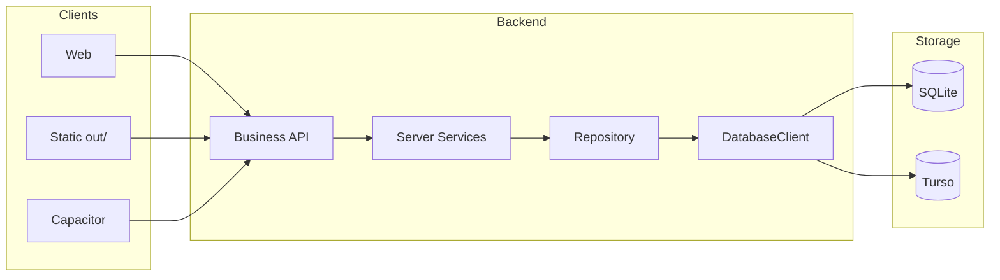

# Cache, Rules, and Data Flow

## Side stores (not source of truth)

### AsolDB (IndexedDB)

**Location:** `src/lib/asol-db/`

| Store | Purpose |
|-------|---------|
| `auth/current` | User session `{ uid, phone, email?, specialties, sessionToken? }` |
| `queryCache` | TanStack Query persistence |
| `guestSessions` | Guest session ID |
| `sellerOnboarding` | Zustand onboarding state |
| `appSettings` | Reserved |

**Rule:** IndexedDB is normally a local cache. Notification-center entries, notification analytics/badges, and notification-only conversation bodies are explicit local-only sources of truth and are never copied to SQLite/Turso.

See [session-system.md](../session-system.md) for session details.

### TanStack Query

- **Reads:** `useQuery` in hooks
- **Writes:** `useMutation` + invalidation
- **Offline:** in-memory cache + AsolDB persister (`asol-db-persister.ts`)

Provider defaults (`query-provider.tsx`):

| Setting | Value |
|---------|-------|
| `staleTime` | 5 min |
| `gcTime` | 24 h |
| `networkMode` | `offlineFirst` |
| `retry` | 1 |
| `refetchOnWindowFocus` | false |

---

## Architectural principles

1. **Clients are platform-agnostic** — Web, static export, Capacitor use the same `AsolApiClient`.
2. **No SQL from the client** — only Business APIs with JSON payloads.
3. **Repository builds queries** — Drizzle only in Repository on the server.
4. **Database Client selects the driver** — dev → SQLite, prod → Turso.
5. **SQLite defines schema** — Turso gets incremental DDL only, never row data.
6. **IndexedDB is a cache** — not the primary data store.

---

## Read flow

```
User
  → UI requests Hook
  → Hook: useQuery → Client Service.getX()
  → asolApi.get('/api/...')
  → Business API → Server Service.getX()
  → Query.execute() → Repository.select()
  → DatabaseClient → SQLite (dev) | Turso (prod)
  ← JSON ← same path back
  → Hook updates cache (optional: AsolDB)
  → UI renders
```

## Write flow

```
UI (submit)
  → Hook: useMutation → Client Service.saveX(payload)
  → asolApi.put/post
  → Business API → Server Service.saveX()
  → Command.execute() → Repository.upsert/insert/update
  → DatabaseClient → DB
  ← JSON
  → Hook: invalidateQueries / setSession in IndexedDB
  → UI
```

## Runtime environments

| Environment | Client → DB |
|-------------|-------------|
| `npm run dev` | Same-origin API → SQLite |
| Vercel prod | API → Turso |
| `build:static` | Remote API → Turso (no local DB) |

## Client/Server diagrams

### Development

```
Browser → AsolApiClient → Business API → Server Service → Query/Command
  → Repository → DatabaseClient → SQLite
```

### Production

```
Browser / Capacitor / Static SPA → AsolApiClient (HTTPS)
  → Business API → Server Service → Query/Command → Repository → DatabaseClient → Turso
```

### Static export

```
Static SPA → AsolApiClient → Remote ASOL Backend → Turso
```

Set `NEXT_PUBLIC_ASOL_API_BASE_URL` at build time.



## Validation placement

- **Client:** Zod in hooks before API calls — see [12-input-validation.md](./12-input-validation.md)
- **Server:** Server Service / Command — domain rules

## Enforcement

`npm run architecture:check` — see [19-architecture-contract.md](./19-architecture-contract.md).
