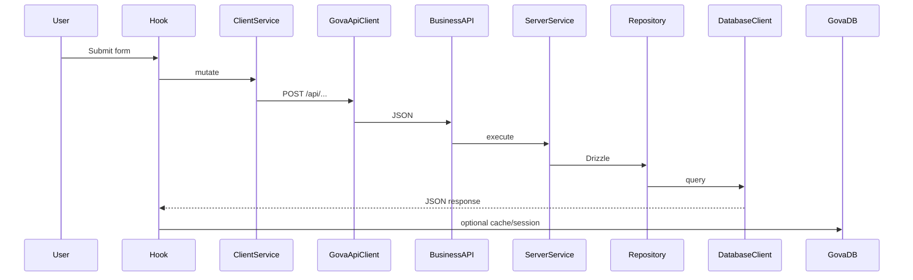

# Scripts & Workflows

## Cheat sheet

```bash
# Development
npm run dev
npm run db:create:sqlite
npm run db:create:profile

# Build
npm run build
npm run build:static
npm run architecture:check
npm run typecheck

# Schema & database
npx drizzle-kit generate
npx drizzle-kit generate --config drizzle.profile.config.ts
npm run db:ensure
npm run db:schema:sync
npm run db:provision:turso
npm run db:push:vercel-env

# Cloudflare R2
npm run r2:sync:cors
```

## Typical: local schema change (users)

```bash
# 1. Edit src/core/database/schema.ts
npx drizzle-kit generate
npm run dev                    # migrations on first API call
npm run build                  # sync DDL to Turso
git push
```

## Typical: static site + remote API

```bash
NEXT_PUBLIC_GOVA_API_BASE_URL=https://api.your-domain.com
npm run build:static
# Deploy out/
```

## Typical: Capacitor

```bash
npm run cap:build
npx cap open android
```

See [capacitor.md](../capacitor.md).

## Typical: new Turso + Vercel

```bash
npm run db:provision:turso
npm run db:push:vercel-env
# Redeploy Vercel
```

## Mutation → cache flow (reference)


