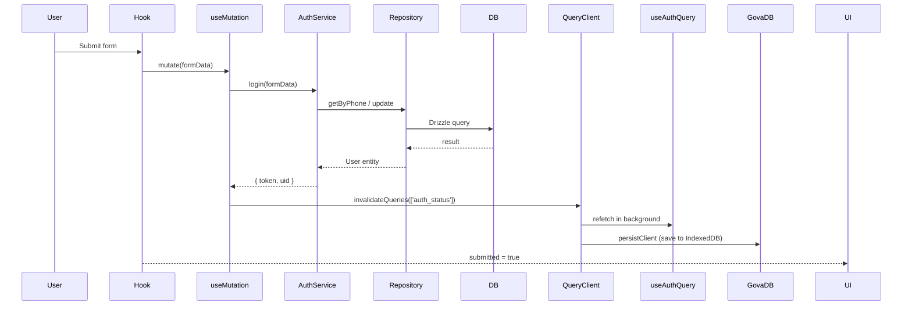
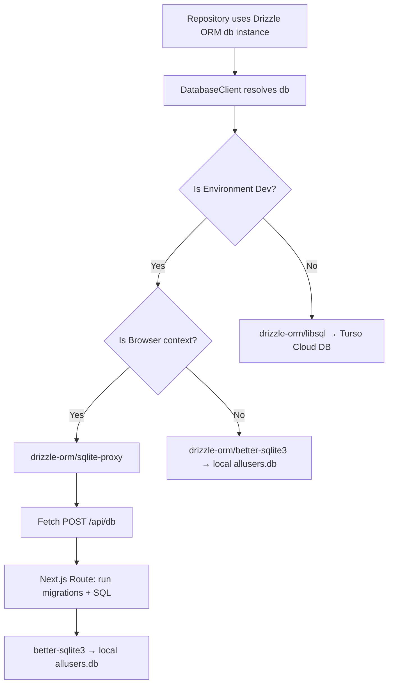

# Project Data Layer Architecture Guide

This guide details the design, configuration, and implementation of the project's flexible, multi-layered data management system. The architecture is built on clean-code principles, decoupling user interfaces, input validation, business rules, read/write operations, repositories, and databases.

**Key technologies:**
- **Drizzle ORM** — type-safe database queries and schema definition
- **drizzle-zod** — automatically generates Zod validation schemas from Drizzle table definitions
- **TanStack Query (React Query)** — server state management, deduplication, and caching for all read operations
- **GovaDB (IndexedDB)** — persistence layer for both authentication state and the React Query cache, enabling offline-first behavior
- The system switches database drivers between **local SQLite** (development) and **Turso (libsql) Cloud Database** (production/static export) automatically at runtime

---

## 🏗️ The 6-Layer Architecture

Data flows sequentially through six distinct boundaries:

```
[ UI Component ] ➔ [ Custom Hook ] ➔ [ Service ] ➔ [ Query / Command ] ➔ [ Repository ] ➔ [ Database Client ]
```

Here is a detailed breakdown of each layer with concrete examples from the codebase:

### 1. UI Component Layer
* **Location:** `src/components/`
* **Responsibility:** Rendering markup and reading outputs (loading spinners, error banners, success redirects) from custom hooks. Contains zero business logic, hashing, or query construction.
* **Example (`LoginPageContent.tsx`):**
  ```typescript
  import { useLogin } from '@/features/auth/hooks/use-login';

  export function LoginPageContent() {
    const { form, isSubmitting, error, submitted, onSubmit } = useLogin();

    return (
      <FormProvider {...form}>
        <form onSubmit={onSubmit} noValidate>
          {error && <div className="text-error">{error}</div>}
          <input {...form.register("phone")} />
          <button type="submit" disabled={isSubmitting}>Login</button>
        </form>
      </FormProvider>
    );
  }
  ```

### 2. Custom Hook Layer
* **Location:** `src/features/[feature]/hooks/`
* **Responsibility:** Manages form state (via React Hook Form & Zod), calls `useMutation` for write operations, calls `useQuery` for read operations, and invalidates cached queries after successful mutations.
* **Read example (`use-auth-query.ts`):**
  ```typescript
  export const AUTH_STATUS_QUERY_KEY = ['auth_status'] as const;

  export function useAuthQuery() {
    return useQuery({
      queryKey: AUTH_STATUS_QUERY_KEY,
      queryFn: () => authService.isAuthenticated(),
    });
  }
  ```
* **Write example (`use-login.ts`):**
  ```typescript
  const mutation = useMutation({
    mutationFn: (data: LoginFormData) => authService.login(data),
    onSuccess: () => {
      queryClient.invalidateQueries({ queryKey: AUTH_STATUS_QUERY_KEY });
    },
  });
  ```

### 3. Service Layer
* **Location:** `src/features/[feature]/services/`
* **Responsibility:** Coordinates business rules, such as password hashing (via **Web Crypto API SHA-256**), session token generation, and writing to IndexedDB. All services implement a typed `Interface` (`IAuthService`) for testability.
* **Example (`auth-service.ts`):**
  ```typescript
  async login(formData: LoginFormData): Promise<{ token: string; uid: string }> {
    const user = await new GetUserByPhoneQuery(this.userRepo).execute(formData.phone);
    if (!user) throw new Error('userNotFound');

    const hashedPassword = await hashPassword(formData.password);
    if (user.password !== hashedPassword) throw new Error('invalidPassword');

    const token = `token_${Date.now()}`;
    await new UpdateLastLoginCommand(this.userRepo).execute(user.uid);
    await govaDbSetAuth({ authToken: token });
    return { token, uid: user.uid };
  }
  ```

### 4. Query / Command Layer (CQRS)
* **Location:** `src/features/[feature]/operations/`
* **Responsibility:** Implements CQRS — reads (**Queries**) and writes (**Commands**) are separate classes, each delegating to the Repository for data access.
* **Example (`create-user.command.ts`):**
  ```typescript
  async execute(user: Omit<User, 'id'>): Promise<void> {
    const existingUser = await this.userRepository.getByPhone(user.phone);
    if (existingUser) throw new Error('phoneAlreadyRegistered');
    await this.userRepository.create(user);
  }
  ```

### 5. Repository Layer
* **Location:** `src/features/[feature]/repositories/`
* **Responsibility:** Interacts with database tables at the entity level. **Does not contain raw SQL strings** — uses Drizzle ORM's type-safe query builders via the `db` instance provided by the Database Client.
* **Example (`user-repository.ts`):**
  ```typescript
  async getByPhone(phone: string): Promise<User | null> {
    const rows = await this.database.db
      .select()
      .from(users)
      .where(and(eq(users.phone, phone), isNull(users.deletedAt)))
      .limit(1);
    if (rows.length === 0) return null;
    return mapRowToUser(rows[0]);
  }
  ```

### 6. Database Client Layer
* **Location:** `src/core/database/`
* **Responsibility:** Exposes the active Drizzle ORM `db` instance and routes to the correct driver based on the environment. All other layers remain completely driver-agnostic.

| Context | Driver | Target |
|---|---|---|
| Dev — Browser | `drizzle-orm/sqlite-proxy` → fetch `/api/db` | `public/sync_data/sync_sqlite/allusers.db` |
| Dev — Node Server | `drizzle-orm/better-sqlite3` | `public/sync_data/sync_sqlite/allusers.db` |
| Production / Static | `drizzle-orm/libsql` | Turso Cloud DB |

---

## 🗄️ Database Schema & Migrations

### Schema Definition
All tables are centrally defined in `src/core/database/schema.ts`:
```typescript
export const users = sqliteTable('users', {
  id: integer('id').primaryKey({ autoIncrement: true }),
  uid: text('uid').notNull().unique(),
  phone: text('phone').notNull().unique(),
  email: text('email'),
  password: text('password').notNull(),
  lastLoginAt: text('last_login_at'),
  createdAt: text('created_at').$defaultFn(() => new Date().toISOString()),
  updatedAt: text('updated_at').$defaultFn(() => new Date().toISOString()),
  deletedAt: text('deleted_at'),
});

export type UserEntity = typeof users.$inferSelect;
export type NewUserEntity = typeof users.$inferInsert;
```

### Migration Pipeline
1. `drizzle.config.ts` at the project root points to `src/core/database/schema.ts` and outputs migrations to `src/core/database/migrations/`.
2. Run `npx drizzle-kit generate` whenever the schema changes.
3. The development Next.js route `/api/db` automatically applies pending migrations on the first request.

---

## 🛡️ Input Validation (drizzle-zod + Zod)

`createInsertSchema` from `drizzle-zod` generates Zod schemas directly from the Drizzle table definition, keeping column types and constraints in sync:
```typescript
import { createInsertSchema } from 'drizzle-zod';
import { users } from '@/core/database/schema';

const baseSchema = createInsertSchema(users, {
  phone: createPhoneField(t),
  password: z.string().min(4, t('auth.validation.passwordMinLength')),
});

// Extend with non-database fields (confirmPassword, phoneVerified)
return baseSchema.pick({ phone: true, password: true, email: true }).extend({
  confirmPassword: z.string().min(1, t('auth.validation.confirmPasswordRequired')),
  phoneVerified: z.boolean().refine((val) => val === true),
}).refine((d) => d.password === d.confirmPassword, { path: ['confirmPassword'] });
```

---

## ⚡ TanStack Query — State Management & Caching

### Overview
TanStack Query is integrated into the Custom Hook layer and handles **all read operations**. Write operations use `useMutation`. The full query cache is persisted to `GovaDB` IndexedDB so data is available immediately on page reload without a network round-trip.

### Provider Setup (`src/core/providers/query-provider.tsx`)
The `AppQueryProvider` wraps the entire application via `src/app/layout.tsx`. It uses `PersistQueryClientProvider` with project-wide defaults:

| Setting | Value | Effect |
|---|---|---|
| `staleTime` | 5 minutes | Serve cached data without refetching for 5 min |
| `gcTime` | 24 hours | Retain data in memory/IndexedDB for 24 h |
| `networkMode` | `offlineFirst` | Serve cache immediately; refetch silently |
| `retry` | 1 | Retry failed queries once |
| `refetchOnWindowFocus` | `false` | No extra fetches when user switches tabs |

### GovaDB Cache Persister (`src/core/database/gova-db-persister.ts`)
The custom persister satisfies the `Persister` interface from `@tanstack/react-query-persist-client`. It uses the existing `GOVA_DB_STORES.QUERY_CACHE` store — no new IndexedDB wrapper is introduced:
```typescript
export function createGovaDbPersister(): Persister {
  return {
    persistClient: async (client) =>
      govaDbSet(GOVA_DB_STORES.QUERY_CACHE, 'rq_cache', client),
    restoreClient: async () =>
      (await govaDbGet(GOVA_DB_STORES.QUERY_CACHE, 'rq_cache')) ?? undefined,
    removeClient: async () =>
      govaDbSet(GOVA_DB_STORES.QUERY_CACHE, 'rq_cache', null),
  };
}
```

### Query Key Conventions
Each feature exports stable, typed query keys as `const` arrays. The auth feature uses:
```typescript
export const AUTH_STATUS_QUERY_KEY = ['auth_status'] as const;
```
Any hook across the project can import and invalidate this key after a related mutation.

### Mutation → Cache Invalidation Flow
After a successful write (login, register), the mutation's `onSuccess` callback invalidates the relevant query, triggering a background refetch:


### Offline-First Behavior
On page load, `PersistQueryClientProvider` calls `restoreClient()` from the persister before any network request is made. Data stored during the previous session is immediately available to `useQuery` hooks, providing seamless offline-first behavior without any extra configuration.

---

## ⚙️ Environment Database Routing Flow



---

## 🧩 Extension Guide: Adding a New Feature

To add a new database-backed, TanStack Query-enabled feature (e.g. `Product`):

1. **Entity** — `src/features/product/entities/product.entity.ts`
2. **Schema** — add table to `src/core/database/schema.ts`, run `npx drizzle-kit generate`
3. **Repository Interface + Implementation** — `src/features/product/repositories/`
4. **Operations** — `src/features/product/operations/commands/` and `/queries/`
5. **Service Interface + Implementation** — `src/features/product/services/`
6. **Query Keys** — export stable key constants from `src/features/product/hooks/`
7. **Custom Hooks** — `useQuery` for reads, `useMutation` for writes with `invalidateQueries` on success
8. **UI Components** — consume the hooks; no business logic in JSX

No changes to `src/core/` are required when adding new features.

---

## 🧪 Testability

| Layer | How to test |
|---|---|
| Repository | Inject a mock `IDatabaseClient` with an in-memory Drizzle instance |
| Service | Inject a mock `IUserRepository` matching `IUserRepository` interface |
| Custom Hook | Mock `IAuthService` and wrap with `QueryClientProvider` in tests |
| UI Component | Render with a mocked `QueryClient` pre-seeded with `queryClient.setQueryData(...)` |

---

## 🛠️ Developer Tooling: GoVa Operation Monitor

In development mode (`process.env.NODE_ENV === 'development'`), developers can access the **GoVa Operation Monitor** at `/dev/monitor`.

### Key Features
1. **Architecture Trace**: Trace operations sequentially across all 6 layers: UI Component ➔ Hook ➔ Service ➔ Query/Command ➔ Repository ➔ DB Client.
2. **Auto-Grouping**: Operations are correlated by `requestFlowId` to group operations triggered by the same user-initiated event.
3. **Database Timing & Memory**: Track performance metrics such as execution time (ms), rows read/written, and heap memory usage.
4. **N+1 and Duplicate Query Detection**: Warns if identical SQL queries are run within 2 seconds or if the same table is SELECTed multiple times in the same flow.
5. **Flame Chart**: Timeline visualization showing relative offsets and execution times of layers.
6. **Result Diffs**: Compares results of a refetched query key and shows a line-by-line colored JSON diff.
7. **DAG Graph Visualizations**: SVG Call Graphs and force-directed architectural dependency maps generated live.
8. **Replay Scrubbing**: timeline scrubber to step through request steps visually.

### Non-Invasive Instrumentation
The monitor is wired at the infrastructure level with zero modification to business logic:
- **TanStack Query Cache**: Subscribes to QueryClient cache events to record query/mutation lifecycle and wrap execution functions.
- **Database Client**: Intercepts `execute()` calls in `AbstractDatabaseClient` to record SQL executions, timing, memory, and handle error stack captures.
- **Zustand Store**: Accumulates traces, executes detection algorithms, and powers the `/dev/monitor` dashboard.
