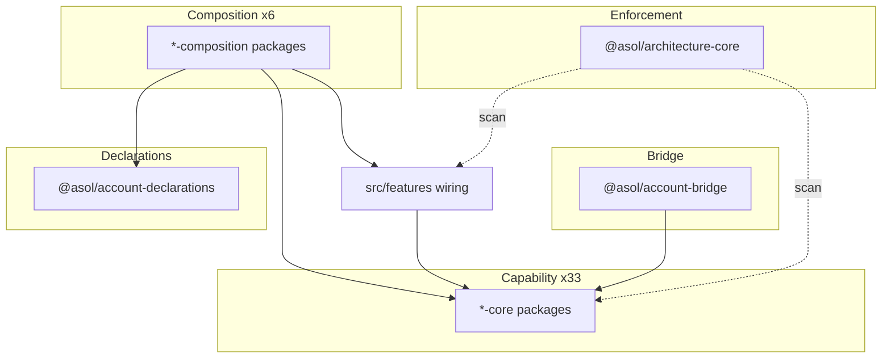

# Architecture Diagrams

## Purpose

Visual reference for agent orientation. Canonical detail remains in linked documents — diagrams summarize, not replace, enforcement rules.

## Scope

High-level architecture views. Per-package detail: [capability-map.md](./capability-map.md), [dependency-map.md](./dependency-map.md).

## Package layer stack



## Application layer stack

```text
┌─────────────┐
│     UI      │  components, pages
└──────┬──────┘
       ▼
┌─────────────┐
│    Hooks    │  state, effects
└──────┬──────┘
       ▼
┌─────────────┐
│Client Svc   │  domain client logic
└──────┬──────┘
       ▼
┌─────────────┐
│ AsolApiClient│ HTTP transport (single owner)
└──────┬──────┘
       ▼
┌─────────────┐
│ Business API│  route handlers, bootstrap
└──────┬──────┘
       ▼
┌─────────────┐
│Server Svc   │  orchestration
└──────┬──────┘
       ▼
┌─────────────┐
│ Query/Cmd   │  operations layer
└──────┬──────┘
       ▼
┌─────────────┐
│ Repository  │  persistence interface
└──────┬──────┘
       ▼
┌─────────────┐
│ DB Client   │  @asol/data-core
└──────┬──────┘
       ▼
   SQLite / Turso
```

Detail: [layer-stack.md](../10-application-layers/layer-stack.md).

## Composition roots

```text
instrumentation.ts
       │
       └── registerAppServerPorts()  ── server-ports.ts
                                              │
                    ┌─────────────────────────┼─────────────────────────┐
                    ▼                         ▼                         ▼
            data-core-ports          storage-core-ports        notifications-core-ports
                    ...                       ...                         ...

Client bootstrap
       │
       └── registerBrowserPorts()  ── browser-ports.ts
                                              │
                    ┌─────────────────────────┼─────────────────────────┐
                    ▼                         ▼                         ▼
            ota-core-ports           page-save-bootstrap       system-logs-bootstrap
```

## Mandatory gateways

```text
                    ┌──────────────────┐
   Application ────►│  @asol/data-core │────► Turso / SQLite
                    └──────────────────┘
                    ┌────────────────────┐
   Application ────►│ @asol/storage-core │────► R2 / S3
                    └────────────────────┘
                    ┌────────────────────┐
   Application ────►│  @asol/native-core │────► Capacitor
                    └────────────────────┘
                    ┌──────────────────────┐
   Page UI ─────────►│ @asol/page-save-core│────► persistence
                    └──────────────────────┘
                    ┌──────────────────────────┐
   Server ──────────►│ @asol/notifications-core│────► Web Push / FCM / APNs
                    └──────────────────────────┘
                    ┌─────────────────┐
   Release ─────────►│ @asol/ota-core  │────► OTA artifacts
                    └─────────────────┘
```

## Enforcement flow

```text
  code change
       │
       ▼
  npm run lint (ESLint)
       │
       ▼
  npm run architecture:check (@asol/architecture-core)
       │
       ▼
  npm run test:*-core (per package)
       │
       ▼
  npm run build (full gate)
```

No GitHub Actions path — Vercel executes build on push to `main`.

## Service deployment topology

```text
Monorepo
├── src/ + packages/     → Main Vercel project (gova)
└── services/
    ├── notifications/   → Vercel project (notifications account)
    ├── orders/
    ├── products/
    ├── profiles/
    ├── submain/
    └── sub2main/
```

## Related Documents

- [README.md](../README.md)
- [Module Isolation Rules](../02-packages/module-isolation-rules.md)
- [Architecture Check](../07-enforcement/architecture-check.md)

## Change Impact

Diagrams MUST be updated when layer model or gateway set changes.

## Invariants

Diagrams reflect 41 packages, 6 compositions, 2 composition roots, 6 mandatory gateways.
