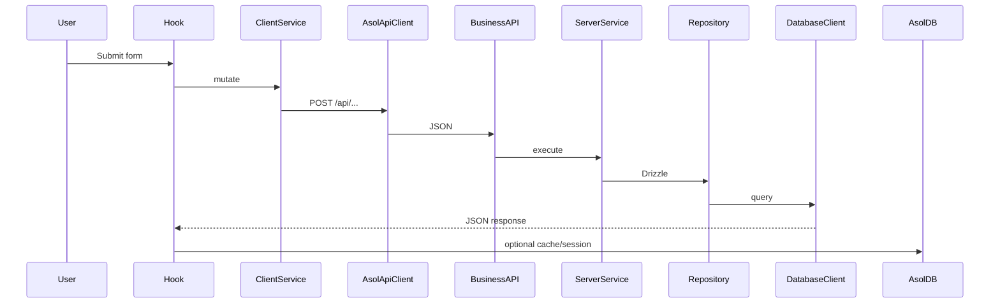

# Scripts & Workflows

## Cheat sheet

```bash
# Development
npm run dev
npm run db:create:sqlite
npm run db:create:profile

# Build & Test Packages
npm run build
npm run build:static
npm run architecture:check
npm run typecheck
npm run test:vercel-deploy-core
npm run test:service-mirror-core
npm run test:account-bridge
npm run test:compositions
npm run test:account-declarations
npm run test:data-core                # every database + offline schema parity
npm run test:orders-core               # the order domain
npm run ci:coverage                    # every package gate actually runs in CI

# Service deployments — the only check that builds what Vercel builds
npm run services:sync            # refresh the four generated/ mirrors
npm run services:verify          # every module edge resolves inside each upload
npm run services:build           # next build in all four service folders

# GitHub repository administration (rule 6)
npm run github:protect -- --dry-run
npm run github:protect

# Schema & database
npm run db:drizzle -- generate
npm run db:drizzle -- generate --config drizzle.profile.config.ts
npm run db:ensure
npm run db:schema:sync
npm run db:schema:sync:release   # required credentials; used by deploy:all preflight
npm run db:provision:turso
npm run provision:mobile-push   # native outbound push credentials → .env.local
npm run db:push:vercel-env      # Turso + bridge URLs + ASOL_MOBILE_PUSH_* when provisioned
npm run deploy:redeploy-main    # pick up new env vars on the GitHub-linked main app
npm run submain:deploy          # full app on submain (groupstenderximages@gmail.com)
npm run sub2main:deploy         # full app on sub2main (tenderx.engineer100@gmail.com)
npm run deploy:all              # preflight + push main + all seven Vercel targets
npm run deploy:all:skip-build   # same without local npm run build
npm run data-access:sync-public

# Cloudflare R2
npm run r2:sync:cors
```

## Typical: local schema change (users)

```bash
# 1. Edit packages/data-core/src/core/database/schema.ts
npm run db:drizzle -- generate
npm run dev                    # migrations on first API call
npm run build                  # sync DDL to Turso
git push
```

All executable database implementations are under
`packages/data-core/src/tooling/`. Package commands are the supported entry
points. Files under `scripts/` may coordinate builds and configuration, but the
architecture check rejects database drivers, SQL, and IndexedDB access there.

## Typical: static site + remote API

```bash
NEXT_PUBLIC_ASOL_API_BASE_URL=https://api.your-domain.com
npm run build:static
# Deploy out/
```

## Typical: Capacitor

```bash
npm run cap:build
npx cap open android

# First-install testing without publishing
npm run cap:run:clean:android

# Audit the generated default state
npm run cap:verify-defaults

# Verify Android cannot restore local state after reinstall
npm run android:backup:validate

# Validate and execute Release optimization without APK/AAB packaging
npm run android:r8:validate
npm run android:r8:verify-release
```

Normal native and OTA updates preserve AsolDB and the current user session.
Clean-run commands are limited to test targets. See
[capacitor.md](../../capacitor/capacitor.md) and
[installation-state-and-clean-testing.md](../../capacitor/installation-state-and-clean-testing.md).

## Typical: new Turso + Vercel

```bash
npm run db:provision:turso
npm run db:push:vercel-env
# Redeploy Vercel
```

## Mutation → cache flow (reference)


# Machine readiness

`npm run doctor:environment` is the read-only onboarding and upgrade report used
from the **Environment Doctor** entry in `.vscode/launch.json`. It covers all
scenarios or accepts `--scenario=development|web|production|android|ios` when
running the TypeScript script directly. It reports:

- Node/npm/Git versions and lockfile-to-`node_modules` consistency;
- compatible npm updates separately from major-version review items;
- the one GitHub-linked Vercel project, seven account tokens (including
  `VERCEL_SUBMAIN_TOKEN` for `groupstenderximages@gmail.com`), and the ephemeral
  Vercel CLI policy;
- JDK 21, Android SDK 36, ADB, and the checked-in Gradle wrapper;
- Xcode requirements on macOS and an explicit not-applicable result elsewhere.

The doctor does not install packages, rewrite configuration, or print secret
values. A missing/update/configure result produces a non-zero exit code, making
it suitable for onboarding and CI diagnostics.

## Service deployment checks

`npm run services:build` (`scripts/build-all-services.ts`) refreshes the four
mirrors and then runs `next build` inside every `services/<name>/` folder,
installing that folder's dependencies first when they are missing.

It is part of `deploy:all`'s preflight, and it is the **only** check in the
repository that exercises what Vercel actually builds. Every other gate runs at
the repository root, where the root's `node_modules` and module graph are
present; a service is uploaded alone and installed against its own
`package.json`. Three production failures reached Vercel through that gap before
this step existed — see
[the module isolation rules](../module-isolation-rules.md#standing-weakness-local-green-is-not-ci-green).

If it reports a missing npm package, the fix is to add the package to that
service's `package.json`, not to the root's. `npm run services:sync` fails the
same way, earlier, through `assertBareSpecifiersAreDeclared`.

### `services:verify` — the gap between written and whole

`npm run services:verify` (`scripts/verify-service-mirrors.ts`) runs between the
two and covers what neither does. The sync writes whatever its graph walker
finds; the build compiles whatever was written. **A specifier the walker cannot
see is never copied, and the build never notices** — resolution is lazy, the
remote build succeeds, and the failure lands on the first request as `Cannot
find module`.

That is not hypothetical. When `@asol/data-core` became an ES module its lazy
driver loads changed from `require(...)` to a `createRequire` handle named
`nodeRequire(...)`; the walker matched on the bare name, and **every database
driver dropped out of all four mirrors while all four still built**. The mirror
counts fell from 101/236/57/178 to 79/220/62/162 and nothing turned red.

The verifier re-reads each upload and resolves every edge inside it — relative
paths, `@/` paths, and `@asol/<package>/<door>` through the mirrored package's
own `exports` map, so an undeclared door is reported rather than quietly
resolved by path. It is in `deploy:all` preflight, in `verify:all`, and in CI.

## Branch protection

`npm run github:protect` (`scripts/protect-main-branch.ts`) applies branch
protection to `main` and then reads it back to verify, rather than trusting the
response code. `--dry-run` prints the full payload and sends nothing.

It needs `GITHUB_ADMIN_TOKEN` in `.env.local` — see
[14. Environment Variables](./14-environment-variables.md#github-repository-administration)
for the token's scope, what it can currently do, and what it should be narrowed
to.

`enforce_admins` is deliberately off: `deploy:all` and `deploy:push` push to
`main` directly and are the supported release paths.
