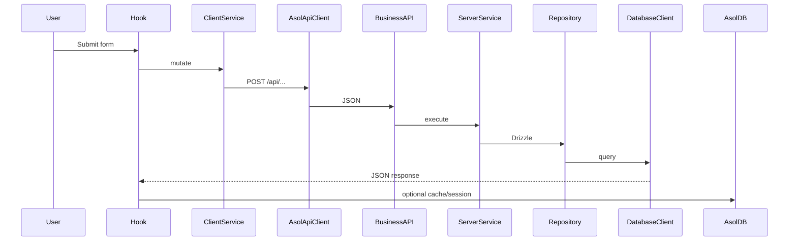

# Scripts & Workflows

## Cheat sheet

```bash
# Development
npm run dev                    # fast Next dev only
npm run dev:checked            # slower startup with generation + catalog validation
npm run db:create:sqlite
npm run db:create:profile

# Build & Test Packages
npm run build
npm run build:static
npm run architecture:check
npm run typecheck
npm run test:vercel-deploy-core
npm run test:service-mirror-core
npm run test:account-bridge
npm run test:compositions
npm run test:account-declarations
npm run test:data-core                # every database + offline schema parity
npm run test:orders-core               # the order domain
npm run ci:coverage                    # every package gate actually runs in CI

# Service deployments — the only check that builds what Vercel builds
npm run services:sync            # refresh the six generated/ mirrors
npm run services:verify          # every module edge resolves inside each upload
npm run services:build           # next build in all six service folders

# GitHub repository administration (rule 6)
npm run github:protect -- --dry-run
npm run github:protect

# Schema & database
npm run db:drizzle -- generate
npm run db:drizzle -- generate --config drizzle.profile.config.ts
npm run db:ensure
npm run db:schema:sync
npm run db:schema:sync:release   # required credentials; used by deploy:all preflight
npm run db:provision:turso
npm run provision:mobile-push   # native outbound push credentials → .env.local
npm run db:push:vercel-env      # Turso + bridge URLs + ASOL_MOBILE_PUSH_* when provisioned
npm run deploy:redeploy-main    # pick up new env vars on the GitHub-linked main app
npm run submain:deploy          # full app on submain (groupstenderximages@gmail.com)
npm run sub2main:deploy         # full app on sub2main (tenderx.engineer100@gmail.com)
npm run vercel:accounts:check   # read-only check for all seven Vercel account tokens
npm run deploy:all              # full gate: env/Vercel → checks/tests → DB → builds → services → main
npm run deploy:all:preflight    # comprehensive preflight only, no commit/push/deploy
npm run deploy:all:publish      # commit + push main only
npm run deploy:all:services     # six CLI service deploys
npm run deploy:all:main         # verify GitHub-linked gova READY
npm run data-access:sync-public

# Cloudflare R2
npm run r2:sync:cors
```

## Typical: local schema change (users)

```bash
# 1. Edit packages/data-core/src/core/database/schema.ts
npm run db:drizzle -- generate
npm run dev                    # migrations on first API call
npm run build                  # sync DDL to Turso
git push
```

All executable database implementations are under
`packages/data-core/src/tooling/`. Package commands are the supported entry
points. Files under `scripts/` may coordinate builds and configuration, but the
architecture check rejects database drivers, SQL, and IndexedDB access there.

## Typical: static site + remote API

```bash
NEXT_PUBLIC_ASOL_API_BASE_URL=https://api.your-domain.com
npm run build:static
# Deploy out/
```

## Typical: Capacitor

```bash
npm run cap:build
npx cap open android

# First-install testing without publishing
npm run cap:run:clean:android

# Audit the generated default state
npm run cap:verify-defaults

# Verify Android cannot restore local state after reinstall
npm run android:backup:validate

# Validate and execute Release optimization without APK/AAB packaging
npm run android:r8:validate
npm run android:r8:verify-release
```

Normal native and OTA updates preserve AsolDB and the current user session.
Clean-run commands are limited to test targets. See
[capacitor.md](../../capacitor/capacitor.md) and
[installation-state-and-clean-testing.md](../../capacitor/installation-state-and-clean-testing.md).

## Typical: new Turso + Vercel

```bash
npm run db:provision:turso
npm run db:push:vercel-env
# Redeploy Vercel
```

## Mutation → cache flow (reference)


# Machine readiness

`npm run doctor:environment` is the read-only onboarding and upgrade report used
from the **Environment Doctor** entry in `.vscode/launch.json`. It covers all
scenarios or accepts `--scenario=development|web|production|android|ios` when
running the TypeScript script directly. It reports:

- Node/npm/Git versions and lockfile-to-`node_modules` consistency;
- compatible npm updates separately from major-version review items;
- the one GitHub-linked Vercel project, seven account tokens (including
  `VERCEL_SUBMAIN_TOKEN` for `groupstenderximages@gmail.com`), and the ephemeral
  Vercel CLI policy;
- JDK 21, Android SDK 36, ADB, and the checked-in Gradle wrapper;
- Xcode requirements on macOS and an explicit not-applicable result elsewhere.

The doctor does not install packages, rewrite configuration, or print secret
values. A missing/update/configure result produces a non-zero exit code, making
it suitable for onboarding and CI diagnostics.

## Service deployment checks

`npm run deploy:all` is organized as a runbook:
phase → section → branch → one command. The phase order is still
`preflight → publish → notifications → products → orders → profiles → submain →
sub2main → main`, but `--list-phases` now prints the nested sections too.

The preflight phase runs before the first Git write. Its sections are:

1. environment and Vercel accounts:
   `doctor:environment:production`, `vercel:accounts:check`;
2. source quality and architecture:
   `lint`, `typecheck`, `architecture:check`, `test`;
3. database and runtime contracts:
   `db:ensure`, `db:schema:sync:release`;
4. main app builds:
   `build`, then `build:static`;
5. isolated service deployments:
   `services:sync`, `services:verify`, then `services:build`.

The publish phase has separate guard, secrets, and Git sections; every service
phase has exactly one deploy branch; the final main phase has one Vercel
readiness verification branch.

`npm run services:build` (`scripts/build-all-services.ts`) refreshes the four
mirrors and then runs `next build` inside every `services/<name>/` folder,
installing that folder's dependencies first when they are missing.

It is part of `deploy:all`'s preflight, and it is the **only** check in the
repository that exercises what Vercel actually builds. Every other gate runs at
the repository root, where the root's `node_modules` and module graph are
present; a service is uploaded alone and installed against its own
`package.json`. Three production failures reached Vercel through that gap before
this step existed — see
[the module isolation rules](../module-isolation-rules.md#standing-weakness-local-green-is-not-ci-green).

If it reports a missing npm package, the fix is to add the package to that
service's `package.json`, not to the root's. `npm run services:sync` fails the
same way, earlier, through `assertBareSpecifiersAreDeclared`.

### `services:verify` — the gap between written and whole

`npm run services:verify` (`scripts/verify-service-mirrors.ts`) runs between the
two and covers what neither does. The sync writes whatever its graph walker
finds; the build compiles whatever was written. **A specifier the walker cannot
see is never copied, and the build never notices** — resolution is lazy, the
remote build succeeds, and the failure lands on the first request as `Cannot
find module`.

The mirror manifest keeps its previous `generatedAt` when the entry points and
file list are byte-equivalent to the previous sync. A deploy that only refreshes
service mirrors therefore must not leave timestamp-only changes in
`services/*/generated/manifest.json`; a new timestamp means the mirrored
content changed.

That is not hypothetical. When `@asol/data-core` became an ES module its lazy
driver loads changed from `require(...)` to a `createRequire` handle named
`nodeRequire(...)`; the walker matched on the bare name, and **every database
driver dropped out of all four mirrors while all four still built**. The mirror
counts fell from 101/236/57/178 to 79/220/62/162 and nothing turned red.

The verifier re-reads each upload and resolves every edge inside it — relative
paths, `@/` paths, and `@asol/<package>/<door>` through the mirrored package's
own `exports` map, so an undeclared door is reported rather than quietly
resolved by path. It is in `deploy:all` preflight, in `verify:all`, and in CI.

## Branch protection

`npm run github:protect` (`scripts/protect-main-branch.ts`) applies branch
protection to `main` and then reads it back to verify, rather than trusting the
response code. `--dry-run` prints the full payload and sends nothing.

It needs `GITHUB_ADMIN_TOKEN` in `.env.local` — see
[14. Environment Variables](./14-environment-variables.md#github-repository-administration)
for the token's scope, what it can currently do, and what it should be narrowed
to.

`enforce_admins` is deliberately off: `deploy:all` and `deploy:push` push to
`main` directly and are the supported release paths.

## main is the only branch

`main` is the sole branch of this repository. Ten others existed at one point and
every one of them was created automatically — Claude Code sessions under
`claude/*`, Cursor cloud agents under `cursor/*`. None held work that `main` did
not already have; the largest diff among them was an empty commit pushed to
retrigger CI. They were deleted in one sweep, and the rule is enforced locally
from that point on.

**`.githooks/pre-push.d/10-main-only`** rejects any push whose remote ref is not
`refs/heads/main`. Branch *deletions* pass through — removing a stray branch is
the outcome the check protects, not something to block.

This is the enforcement layer, and its limit is worth stating plainly: it runs
only in a checkout that has `core.hooksPath` set. A Cursor cloud agent, a Claude
Code cloud session, or the GitHub web UI can still create a branch. Agents
working in this repository are told not to by rule 10 of `CLAUDE.md`; the hook
covers the local path and nothing beyond it.

## The pre-push hook

Git allows exactly one `pre-push` hook file, so `.githooks/pre-push` is a
dispatcher: it captures the ref lines Git sends on stdin, replays them into every
file in `.githooks/pre-push.d/`, and fails the push if any check fails. Every
check runs even after one fails, so a push held back for two reasons says so once
rather than over two attempts.

The hooks live in a tracked directory rather than `.git/hooks` so they ship with
the repository; `core.hooksPath` is pointed at `.githooks` by the `prepare` npm
script, which npm runs on install. `.gitattributes` pins the directory to LF —
`core.autocrlf` is on here, and a CRLF shebang fails as `/bin/sh^M` on a fresh
checkout, which is exactly when the checks matter most. `git push --no-verify`
bypasses all of them, deliberately, for the one-off case.

### `20-sync-data-committed`

Refuses to push while `git status --porcelain -- public/sync_data` reports
anything. Those files are tracked on purpose: the shard SQLite files are the
schema sources the development server reads, and the `*-schema-sync-report.json`
files record what the last sync produced. A push that carries code but leaves a
changed shard in the working tree puts GitHub a step behind the machine that
generated it, and the next clone gets a schema that never matched anything.

`--porcelain` covers modified, staged, deleted, and untracked files and honours
`.gitignore`, so `sync_sqlite/system-ops.db` — deliberately ignored as runtime
log data, see [11. Current Databases](./11-current-databases.md) — never trips it.

`deploy:all` and `deploy:push` are unaffected: both `git add -A` and commit before
they push, so `public/sync_data` is already clean by the time the hook runs.

### `30-secrets-backup-committed`

Same rule, applied to the two files `npm run secrets:backup` publishes into
`config/` — `secret-archive-latest.zip.enc` and its
`.private-key.pem` (`PORTABLE_ARCHIVE_PATH` and `PORTABLE_RECOVERY_KEY_PATH` in
`packages/secrets-core/src/archive/archive-workspace.ts`). They are tracked on
purpose: the portable backup exists so a fresh clone can restore the project's
secrets, and a backup that never left the machine that made it is not a backup.
A regenerated archive left in the working tree means GitHub still carries the
previous one, and a restore elsewhere silently gets stale secrets.

`deploy:all` runs `secrets:backup` inside `publish`, so this also catches a
release whose archive was regenerated but not staged.

### The server-side block

`npm run github:block-branches` (`scripts/block-branch-creation.ts`) applies a
repository ruleset named `main-only` that restricts creation for `~ALL` refs
except `refs/heads/main`, and reads it back to verify. It is **applied**.

This is the layer that actually holds, because it does not depend on a checkout:
`git push`, the GitHub web UI, and a cloud agent's admin-scoped API call are all
refused — the API path returns `422 Reference update failed`, the push path
returns `GH013 ... creations being restricted`.

The ruleset carries no bypass actors. Repository admins are not exempt from
rulesets by default and are not made exempt here: the automation that created
those ten branches pushed with an owner-scoped token, so an admin exemption would
exempt exactly the thing being blocked.

**It cannot restrict a push to `main`.** The rule is `creation` only — not
`update`, not `deletion`, not `non_fast_forward` — and `refs/heads/main` is
excluded from the ruleset's conditions on top of that. `GET /repos/{repo}/rules/branches/main`
returns an empty list, which is the direct confirmation: GitHub applies no ruleset
rule to `main`. Normal pushes, force pushes, and deploy pushes are untouched.

`--dry-run` prints the payload without sending, and `--remove` deletes the ruleset
if branches are ever wanted again. It reads `GITHUB_ADMIN_TOKEN` from `.env.local`,
the same token as `github:protect`.

Note that a ruleset is a separate GitHub system from the branch protection
described above: `github:protect` governs how `main` may move,
`github:block-branches` governs whether any other branch may exist. Neither
replaces the other.

### What is unrestricted on `main`

Deliberately, nothing blocks the owner from pushing to `main` in any form. Branch
protection sets `required_status_checks: ['verify']` and a pull-request
requirement, but `enforce_admins` is `false`, so the owner's direct pushes bypass
both — a real push reports `Bypassed rule violations for refs/heads/main` and
succeeds. That is the supported release path for `deploy:all` and `deploy:push`,
and the ruleset above was written not to touch it.

Nothing in `deploy:all`, `deploy:push`, or `.github/workflows/native-core.yml`
creates a branch, so no release or CI path is affected either way.
