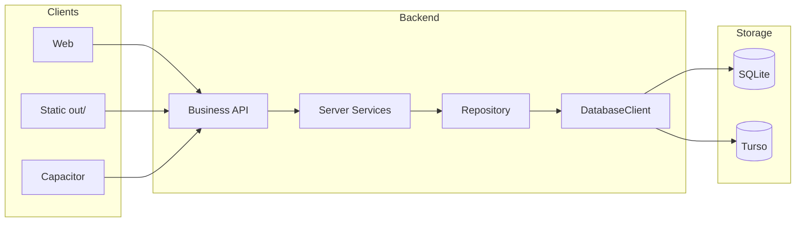

> **Note:** Operational detail relocated here during the 2026-08 architecture reconstruction. Architectural relationships: [docs/01-architecture/](../01-architecture/README.md).

# Cache, Rules, and Data Flow

## Side stores (not source of truth)

### AsolDB (IndexedDB)

**Location:** `packages/data-core/src/browser/asol-db/`

| Store | Purpose |
|-------|---------|
| `auth/current` | User session `{ uid, phone, email?, specialties, sessionToken? }` |
| `queryCache` | TanStack Query persistence |
| `guestSessions` | Guest session ID |
| `sellerOnboarding` | Zustand onboarding state |
| `appSettings` | Shared application settings |
| `imageUploadDrafts` | Durable staged image uploads |
| `imageCache` | Bounded remote image Blob cache with ETag metadata |

**Rule:** IndexedDB is normally a local cache. Notification-center entries, notification analytics/badges, and notification-only conversation bodies are explicit local-only sources of truth and are never copied to SQLite/Turso.

See [session-system.md](../05-platform-features/session-system.md) for session details.

### TanStack Query

`@asol/data-core/browser` is the sole browser query-runtime and IndexedDB gateway. Application hooks import `useQuery`, `useMutation`, `useQueries`, and `useQueryClient` from that shared browser-safe door; the root manifest no longer owns TanStack directly.

- **Reads:** `useQuery` / `useQueries` through `@asol/data-core/browser`
- **Writes:** `useMutation` plus explicit `setQueryData` / invalidation
- **Offline:** in-memory cache + AsolDB `queryCache` persister
- **Persistence compatibility:** schema buster `asol-query-cache-v2`, not `buildId`
- **Persisted max age:** 7 days
- **Identity boundary:** logout and invalid-session handling clear memory + persisted query state

Default `localFirst` policy:

| Setting | Value |
|---------|-------|
| `staleTime` | 30 min |
| `gcTime` | 7 days |
| `networkMode` | `offlineFirst` |
| `retry` | 1 |
| `refetchOnMount` | only when stale |
| `refetchOnWindowFocus` | false |
| `refetchOnReconnect` | true |

Named policies also exist for user-owned (1 h), static (infinite), and volatile (30 s) data. A feature should choose a named policy when it genuinely needs different freshness rather than forcing `staleTime: 0` or `refetchOnMount: "always"`.

#### Mandatory browser GET gateway

Every browser JSON `GET` through `AsolApiClient`, including imperative reads that are not wrapped by a feature hook, is forced through the same local-read gate. Cacheable policies wait for the persisted TanStack cache to be restored from AsolDB before `fetchQuery` may run. Missing browser composition fails closed: it raises an error and performs no cloud request.

```text
AsolApiClient GET -> local-read gate
  -> cacheable policy -> memory QueryClient -> restore/check AsolDB queryCache -> freshness policy -> network loader
  -> network-authoritative policy -> direct network loader
```

Transport-level defaults are intentionally shorter than feature-level policies: ordinary content is local-first for 5 minutes, volatile routes for 30 seconds, static reads may be infinite, and operational/security reads are network-authoritative. Network-authoritative requests are classified by the same gate but deliberately bypass QueryClient/AsolDB caching and in-flight deduplication so every call observes a fresh, cancellation-independent transport attempt. Successful mutations invalidate the transport-read namespace before the next cacheable read. Session/header values are hashed in persisted transport cache keys and are never stored in clear text as query-key material.

Binary operational artifacts (OTA/archive downloads) are not JSON application data and keep their explicit download lifecycle. Public app assets are already project-owned files and do not enter the remote-data cache.

### Remote images

Remote HTTP(S) images use one local-first path owned by `@asol/storage-image-manager-core/image-cache` with persistence primitives in `@asol/data-core/browser`:

```text
render request -> memory -> AsolDB imageCache -> conditional network download
                                  |
                                  +-> stale Blob on offline/network failure
```

Local/public asset paths, `data:` URLs, and `blob:` URLs are never copied into `imageCache`. Concurrent requests for the same cache key share one in-flight download. Expired entries use ETag revalidation when R2 supplies an ETag, avoiding a second Blob transfer on `304 Not Modified`.

Remote image rendering is fail-closed. A cache miss may invoke only the registered image-download port after the memory/AsolDB checks. If that download fails and no stale Blob exists, the renderer receives a local transparent placeholder, never the original HTTP(S) URL. Build-gated tests pin the allowed `next/image` importers, the single raw `` local-preview exception, and the sole consumer of `AsolApiClient.getAbsoluteBinaryResponse`.

---

## Architectural principles

1. **Clients are platform-agnostic** — Web, static export, Capacitor use the same `AsolApiClient`.
2. **No SQL from the client** — only Business APIs with JSON payloads.
3. **Repository builds queries** — Drizzle only in Repository on the server.
4. **Database Client selects the driver** — dev → SQLite, prod → Turso.
5. **SQLite defines schema** — Turso gets incremental DDL only, never row data.
6. **IndexedDB is a cache** — not the primary data store.

---

## Read flow

```
User
  → UI requests Hook
  → Hook: useQuery → Client Service.getX()
  → asolApi.get('/api/...')
  → Business API → Server Service.getX()
  → Query.execute() → Repository.select()
  → DatabaseClient → SQLite (dev) | Turso (prod)
  ← JSON ← same path back
  → Hook updates cache (optional: AsolDB)
  → UI renders
```

## Write flow

```
UI (submit)
  → Hook: useMutation → Client Service.saveX(payload)
  → asolApi.put/post
  → Business API → Server Service.saveX()
  → Command.execute() → Repository.upsert/insert/update
  → DatabaseClient → DB
  ← JSON
  → Hook: invalidateQueries / setSession in IndexedDB
  → UI
```

## Runtime environments

| Environment | Client → DB |
|-------------|-------------|
| `npm run dev` | Same-origin API → SQLite |
| Vercel prod | API → Turso |
| `build:static` | Remote API → Turso (no local DB) |

## Client/Server diagrams

### Development

```
Browser → AsolApiClient → Business API → Server Service → Query/Command
  → Repository → DatabaseClient → SQLite
```

### Production

```
Browser / Capacitor / Static SPA → AsolApiClient (HTTPS)
  → Business API → Server Service → Query/Command → Repository → DatabaseClient → Turso
```

### Static export

```
Static SPA → AsolApiClient → Remote ASOL Backend → Turso
```

Set `NEXT_PUBLIC_ASOL_API_BASE_URL` at build time.



## Validation placement

- **Client:** Zod in hooks before API calls — see [12-input-validation.md](../01-architecture/10-application-layers/input-validation.md)
- **Server:** Server Service / Command — domain rules

## Enforcement

`npm run architecture:check` — see [19-architecture-contract.md](../01-architecture/10-application-layers/layer-stack.md).
