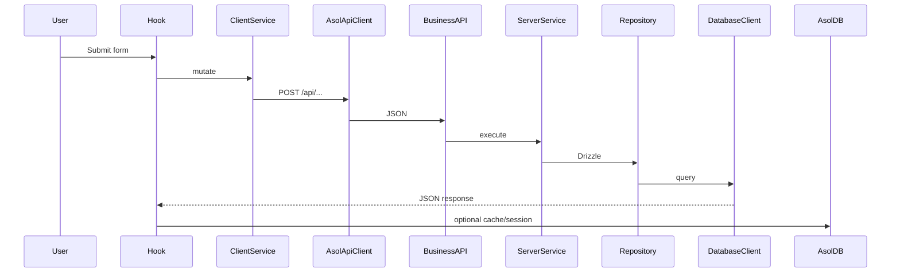

> **Note:** Operational detail relocated here during the 2026-08 architecture reconstruction. Architectural relationships: [docs/01-architecture/](../01-architecture/README.md).

# Scripts & Workflows

## Cheat sheet

```bash
# Development
npm run dev                    # fast Next dev only
npm run dev:checked            # slower startup with generation + catalog validation
npm run db:create:sqlite
npm run db:create:profile

# Build & Test Packages
npm run build
npm run build:static
npm run architecture:check
npm run typecheck
npm run test:vercel-deploy-core
npm run test:service-mirror-core
npm run test:account-bridge
npm run test:compositions
npm run test:account-declarations
npm run test:data-core                # every database + offline schema parity
npm run test:orders-core               # the order domain
npm run github:ci-policy               # local guard: only docs/** GitHub workflow exists
npm run docs:check                     # documentation contract (also the docs workflow)

# Service deployments — the only check that builds what Vercel builds
npm run services:sync            # refresh the six generated/ mirrors
npm run services:verify          # every module edge resolves inside each upload
npm run services:build           # next build in all six service folders

# GitHub repository administration
npm run github:protect -- --status     # confirm main has no branch protection
npm run github:protect -- --remove     # delete leftover protection (apply is forbidden)
npm run github:block-branches -- --dry-run
npm run github:ci-policy

# Schema & database
npm run db:drizzle -- generate
npm run db:drizzle -- generate --config drizzle.profile.config.ts
npm run db:ensure
npm run db:schema:sync
npm run db:schema:sync:release   # required credentials; used by deploy:all preflight
npm run db:provision:turso
npm run provision:mobile-push   # native outbound push credentials → .env.local
npm run db:push:vercel-env      # Turso + bridge URLs + ASOL_MOBILE_PUSH_* when provisioned
npm run deploy:redeploy-main    # pick up new env vars on the GitHub-linked main app
npm run submain:deploy          # full app on submain (groupstenderximages@gmail.com)
npm run sub2main:deploy         # full app on sub2main (tenderx.engineer100@gmail.com)
npm run vercel:accounts:check   # read-only check for all seven Vercel account tokens
npm run deploy:all              # full gate: env/Vercel → checks/tests → DB → builds → services → main
npm run deploy:all:preflight    # comprehensive preflight only, no commit/push/deploy
npm run deploy:all:publish      # commit + push main only
npm run deploy:all:services     # six CLI service deploys
npm run deploy:all:main         # verify GitHub-linked gova READY
npm run data-access:sync-public

npm run secrets:backup
npm run secrets:restore
npm run secrets:verify             # names/paths only: present/empty/missing/file-present/file-missing
npm run secrets:key:init

# Cloudflare R2
npm run r2:sync:cors
```

## Typical: local schema change (users)

```bash
# 1. Edit packages/data-core/src/core/database/schema.ts
npm run db:drizzle -- generate
npm run dev                    # migrations on first API call
npm run build                  # sync DDL to Turso
git push
```

All executable database implementations are under
`packages/data-core/src/tooling/`. Package commands are the supported entry
points. Files under `scripts/` may coordinate builds and configuration, but the
architecture check rejects database drivers, SQL, and IndexedDB access there.

## Typical: static site + remote API

```bash
NEXT_PUBLIC_ASOL_API_BASE_URL=https://api.your-domain.com
npm run build:static
# Deploy out/
```

## Typical: Capacitor

```bash
npm run cap:build
npx cap open android

# First-install testing without publishing
npm run cap:run:clean:android

# Audit the generated default state
npm run cap:verify-defaults

# Verify Android cannot restore local state after reinstall
npm run android:backup:validate

# Validate and execute Release optimization without APK/AAB packaging
npm run android:r8:validate
npm run android:r8:verify-release
```

Normal native and OTA updates preserve AsolDB and the current user session.
Clean-run commands are limited to test targets. See
[capacitor.md](./capacitor/capacitor.md) and
[installation-state-and-clean-testing.md](./capacitor/installation-state-and-clean-testing.md).

## Typical: new Turso + Vercel

```bash
npm run db:provision:turso
npm run db:push:vercel-env
# Redeploy Vercel
```

## Mutation → cache flow (reference)


# Machine readiness

`npm run doctor:environment` is the read-only onboarding and upgrade report used
from the **Environment Doctor** entry in `.vscode/launch.json`. It covers all
scenarios or accepts `--scenario=development|web|production|android|ios` when
running the TypeScript script directly. It reports:

- Node/npm/Git versions, the complete peer/transitive `npm ls --all` graph,
  and lockfile-to-`node_modules` consistency;
- the immutable `config/runtime-compatibility-reference.json` result across
  root, all auto-discovered packages and services, Ruby, Android, and deployment
  tools;
- registry updates only when explicitly requested with
  `npm run dependencies:outdated`; they are advisory and never rewrite the
  reference;
- the one GitHub-linked Vercel project, seven account tokens (including
  `VERCEL_SUBMAIN_TOKEN` for `groupstenderximages@gmail.com`), and the ephemeral
  Vercel CLI policy;
- JDK 21, Android SDK 36, ADB, and the checked-in Gradle wrapper;
- Xcode requirements on macOS and an explicit not-applicable result elsewhere.

The doctor does not install packages, rewrite configuration, or print secret
values. `npm run dependencies:install` is the separate reproducible installer;
it executes the bundled native/tool binaries and validates the complete npm
graph. A missing or incompatible result produces a non-zero exit code, making
the doctor suitable for onboarding and CI diagnostics.

The repository-root `.vercelignore` excludes native build trees and generated
artifacts from the hosted source upload. Runtime compatibility and project
correctness remain local preflight responsibilities; the hosted Vercel command
does not repeat those gates.
The root `vercel.json` pins the remote install command to `npm ci`; Vercel must
consume the reviewed lockfile byte-for-byte instead of rewriting it before the
compatibility gate executes.
Vercel runs only the deployment/smoke build contract: environment key presence,
`next build`, required server artifact manifests, and function upload-size
limits. Documentation drift, package-door import checks, tests, lint, and
typechecking remain in local `npm run build` / `deploy:all` preflight.

## Service deployment checks

`npm run deploy:all` is organized as a runbook:
phase → section → branch → one command. The phase order is still
`preflight → publish → notifications → products → orders → profiles → submain →
sub2main → main`, but `--list-phases` now prints the nested sections too.

The preflight phase runs before the first Git write. Its sections are:

1. environment and Vercel accounts:
   `doctor:environment:production`, `vercel:accounts:check`;
2. source quality and architecture:
   `lint`, `typecheck`, `architecture:check`, `test`;
3. database and runtime contracts:
   `db:ensure`, `db:schema:sync:release`;
4. main app builds:
   `build`, then `build:static`;
5. isolated service deployments:
   `services:sync`, `services:verify`, then `services:build`.

The publish phase has separate guard, secrets, and Git sections; every service
phase has exactly one deploy branch; the final main phase has one Vercel
readiness verification branch.

`npm run services:build` (`scripts/build-all-services.ts`) refreshes the six
mirrors and then runs `next build` inside every `services/<name>/` folder,
installing that folder's dependencies first when they are missing.

It is part of `deploy:all`'s preflight, and it is the **only** check in the
repository that exercises what Vercel actually builds. Every other gate runs at
the repository root, where the root's `node_modules` and module graph are
present; a service is uploaded alone and installed against its own
`package.json`. Three production failures reached Vercel through that gap before
this step existed — see
[the module isolation rules](../01-architecture/02-packages/module-isolation-rules.md#standing-weakness-local-green-is-not-ci-green).

If it reports a missing npm package, the fix is to add the package to that
service's `package.json`, not to the root's. `npm run services:sync` fails the
same way, earlier, through `assertBareSpecifiersAreDeclared`.

### `services:verify` — the gap between written and whole

`npm run services:verify` (`scripts/verify-service-mirrors.ts`) runs between the
two and covers what neither does. The sync writes whatever its graph walker
finds; the build compiles whatever was written. **A specifier the walker cannot
see is never copied, and the build never notices** — resolution is lazy, the
remote build succeeds, and the failure lands on the first request as `Cannot
find module`.

The mirror manifest keeps its previous `generatedAt` when the entry points and
file list are byte-equivalent to the previous sync. A deploy that only refreshes
service mirrors therefore must not leave timestamp-only changes in
`services/*/generated/manifest.json`; a new timestamp means the mirrored
content changed.

That is not hypothetical. When `@asol/data-core` became an ES module its lazy
driver loads changed from `require(...)` to a `createRequire` handle named
`nodeRequire(...)`; the walker matched on the bare name, and **every database
driver dropped out of all four mirrors while all four still built**. The mirror
counts fell from 101/236/57/178 to 79/220/62/162 and nothing turned red.

The verifier re-reads each upload and resolves every edge inside it — relative
paths, `@/` paths, and `@asol/<package>/<door>` through the mirrored package's
own `exports` map, so an undeclared door is reported rather than quietly
resolved by path. It is in `deploy:all` preflight and in `verify:all`.

## GitHub CI and `main`

See [github-ci-policy.md](./github-ci-policy.md). GitHub Actions is not a
correctness gate. Code pushes to `main` run no workflows. A commit that touches
`docs/**` runs the docs workflow only.

## Branch protection

**There is no branch protection on `main`, deliberately.**
`GET /repos/{repo}/branches/main/protection` must return `404`.

`npm run github:protect` refuses to apply protection. `npm run github:protect -- --remove`
deletes a leftover rule. `npm run github:protect -- --status` reads it back.
The credential is `GITHUB_ADMIN_TOKEN` in `.env.local`.

A push to `main` must succeed regardless of what the code does. Local npm
scripts and `deploy:all` preflight remain the reviewer. There is no required
GitHub status check.

## main is the only branch

`main` is the sole branch of this repository. Ten others existed at one point and
every one of them was created automatically by ephemeral development sessions.
None held work that `main` did not already have; the largest diff among them was an empty commit pushed to
retrigger CI. They were deleted in one sweep, and the rule is enforced locally
from that point on.

**`.githooks/pre-push.d/10-main-only`** rejects any push whose remote ref is not
`refs/heads/main`. Branch *deletions* pass through — removing a stray branch is
the outcome the check protects, not something to block.

This is the enforcement layer, and its limit is worth stating plainly: it runs
only in a checkout that has `core.hooksPath` set. A remote workspace or the
GitHub web UI can still create a branch. The project-wide branch policy forbids
that path; the hook covers the local checkout and nothing beyond it.

## The pre-push hook

Git allows exactly one `pre-push` hook file, so `.githooks/pre-push` is a
dispatcher: it captures the ref lines Git sends on stdin, replays them into every
file in `.githooks/pre-push.d/`, and fails the push if any check fails. Every
check runs even after one fails, so a push held back for two reasons says so once
rather than over two attempts.

The hooks live in a tracked directory rather than `.git/hooks` so they ship with
the repository; `core.hooksPath` is pointed at `.githooks` by the `prepare` npm
script, which npm runs on install. `.gitattributes` pins the directory to LF —
`core.autocrlf` is on here, and a CRLF shebang fails as `/bin/sh^M` on a fresh
checkout, which is exactly when the checks matter most. `git push --no-verify` bypasses local hooks. Git cannot remove that flag.
Do not use it to push any ref other than `main`.

`10-main-only` is the only check. Two others existed briefly — one refusing to
push while `public/sync_data` was dirty, one for the `secrets:backup` output in
`config/` — and both were removed on purpose. They enforced a real rule, but they
enforced it by holding back the push, and a push to `main` is not supposed to be
held back for any reason. The preservation requirement they encoded remains a
release rule rather than a push gate. `10-main-only` stays because what it refuses is not
a push to `main` at all.

### What is unrestricted on `main`

Nothing blocks a push to `main`, in any form, from any credential. Not
"blocked but bypassed" — absent:

| Checked | Result |
| :--- | :--- |
| `GET /rules/branches/main` | `[]` — the `main-only` ruleset excludes it |
| `GET /branches/main/protection` | `404` — no protection rule exists |
| Local hooks | only `10-main-only`, which never inspects a push to `main` |
| GitHub Actions | skipped unless the commit touches `docs/**`; then docs-only |

Force pushes, non-fast-forward pushes, and pushes carrying failing code all
succeed. That last one is deliberate: a release path that a failing check can
block is a release path that can be lost.

### Vercel picks up every push

The `gova` project is linked by GitHub App — `link.type: github`,
`link.repoId: 1276783681`, `link.productionBranch: main` — and every push to
`main` produces a production deployment with `meta.githubDeployment: 1`. Verified
by matching eight consecutive commits against their deployments, all `READY`.

The link is stored by numeric repo id, so renaming the *repository* would not
break it. `productionBranch` is the literal string `main`, so **renaming the
branch would**. That is the concrete reason `main` is never renamed, on top of
being the only branch this repository allows.

Nothing in `deploy:all` or `deploy:push` creates a branch, so no release path
is affected either way.

## Retained local notes (not project documentation)

These paths were re-evaluated and **kept**. They are not unused source, and they
are not project documentation (`docs/` remains the only English project docs
tree):

| Path | Evidence | Policy |
| --- | --- | --- |
| `note/k1.md` | Operator reconstruction brief for `docs/01-architecture/`. No imports, scripts, or CI entry points. | Retained as a local brief. Do not treat as a runtime or docs source. |
| `note/note1.md` | Operator PowerShell/IDE scratch notes. No imports or tooling entry points. | Retained as local scratch. |
| `test_profile/*.cmd`, `*.ps1`, `*.lnk`, `*.bat` | Tracked developer launchers. `git ls-files test_profile` lists them. | Keep tracked. |
| `test_profile/manageProfile/` | Local Chrome profile caches. Gitignored. | Must stay untracked. `.vercelignore` excludes the whole `test_profile/` tree. |
